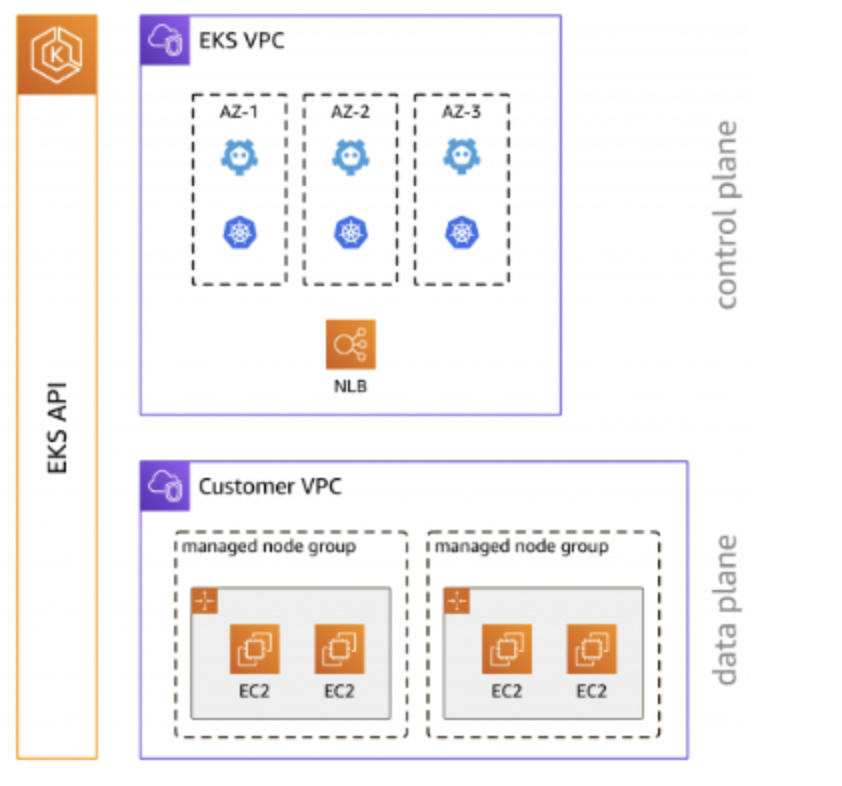

# Getting Started with Amazon Elastic Kubernetes Service (EKS)

This workshop provides an introduction to Kubernetes using the AWS managed Kubernetes service Amazon EKS. Previous experience with Kubernetes or container workflows is useful but not required. During this workshop you deploy everything needed to have a set of microservices running with additional useful day-2 functionality in place.

Note: this lab will go live in January and there will be terraform files to spin up the init stuff!
https://reinvent.eksworkshop.com/

## Microservices on Kubernetes

Now that we're familiar with the overall architecture of the sample application, how will we initially deploy this in to EKS? Lets explore some of the Kubernetes building blocks by looking at the catalog component:

There are a number of things to consider in this diagram:

- The application that provides the catalog API runs as a Pod, which is the smallest deployable unit in Kubernetes. Application Pods will run the container images we outlined in the previous section.
- The Pods that run for the catalog component are created by a Deployment which may manage one or more "replicas" of the catalog Pod, allowing it to scale horizontally.
- A Service is an abstract way to expose an application running as a set of Pods, and this allows our catalog API to be called by other components inside the Kubernetes cluster. Each Service is given its own DNS entry.
- We are starting this workshop with a MySQL database that runs inside our Kubernetes cluster as a StatefulSet, which is designed to manage stateful workloads.
- All of these Kubernetes constructs are grouped in their own dedicated catalog Namespace. Each of the application components has its own Namespace.

Each of the components in the microservices architecture is conceptually similar to the catalog, using Deployments to manage application workload Pods and Services to route traffic to those Pods. If we expand out our view of the architecture we can consider how traffic is routed throughout the broader system:


## Deploying a Component

The sample application is composed of a set of Kubernetes manifests organized in a way that can be easily applied with Kustomize. Kustomize is an open-source tool also provided as a native feature of the kubectl CLI. This workshop uses Kustomize to apply changes to Kubernetes manifests, making it easier to understand changes to manifest files without needing to manually edit YAML. As we work through the various modules of this workshop, we will incrementally apply overlays and patches with Kustomize.

Before we do anything lets inspect the current Namespaces in our EKS cluster:

`kubectl get namespaces`

All of the entries listed are Namespaces for system components that were pre-installed for us. We'll ignore these by using Kubernetes labels to filter the Namespaces down to only those we've created:

`kubectl get namespaces -l app.kubernetes.io/created-by=eks-workshop`

The first thing we'll do is deploy the catalog component by itself. The manifests for this component can be found in `/workspace/manifests/catalog`.

`ls /workspace/manifests/catalog`

These manifests include the Deployment for the catalog API in `/workspace/manifests/catalog/deployment.yaml`.

This Deployment expresses the desired state of the catalog API component:

- Use the public.ecr.aws/aws-containers/retail-store-sample-catalog container image
- Run a single replica
- Expose the container on port 8080 named http
- Run probes/healthchecks against the /health path
- Requests a specific amount of CPU and memory so the Kubernetes scheduler can place it on a node with enough available resourcs
- Apply labels to the Pods so other resources can refer to them


The manifests also include the Service used by other components to access the catalog API in `/workspace/manifests/catalog/service.yaml`

This Service:

- Selects catalog Pods using labels that match what we expressed in the Deployment above
- Exposes itself on port 80
- Targets the http port exposed by the Deployment, which translates to port 8080

Lets create the catalog component:

`kubectl apply -k /workspace/manifests/catalog`

Now we'll see a new Namespace:

`kubectl get namespaces -l app.kubernetes.io/created-by=eks-workshop`

We can take a look at the Pods running in this namespace:

`kubectl get pod -n catalog`

Notice we have a Pod for our catalog API and another for the MySQL database. The catalog Pod is showing a status of CrashLoopBackOff. This is because it needs to be able to connec tto the catalog-mysql Pod before it will start, and Kubernetes will keep restarting it until this is the case. Luckily we can use kubectl wait to monitor specific Pods until they are in a Ready state:

`kubectl wait --for=condition=Ready pods --all -n catalog --timeout=180s`

Now that the Pods are running we can check their logs, for example the catalog API:

`kubectl logs -n catalog deployment/catalog`

Kubernetes also allows us to easily scale the number of catalog Pods horizontally:

```
kubectl scale -n catalog --replicas 3 deployment/catalog
kubectl wait --for=condition=Ready pods --all -n catalog --timeout=180s
```

The manifests we applied also create a Service for each of our application and MySQL Pods that can be used by other components in the cluster to connect:

`kubectl get svc -n catalog`

These Services are internal to the cluster, so we cannot access them from the Internet or even the VPC. However, we can use exec to access an existing Pod in the EKS cluster to check the catalog API is working:

`kubectl -n catalog exec -it \ deployment/catalog -- curl catalog.catalog.svc/catalogue | jq .`

## Other Components

In this section we'll deploy the rest of the sample application efficiently using the power of Kustomize. The following kustomization file shows how you can reference other kustomizations and deploy multiple components together in  `/workspace/manifests/kustomization.yaml`

> Notice that the catalog API is in this kustomization, didn't we already deploy it?
>
> Because Kubernetes uses a declarative mechanism we can apply the manifests for the catalog API again
> and expect that because all of the resources are already created Kubernetes will take no action.

Apply this kustomization to our cluster to deploy the rest of the components:

`kubectl apply -k /workspace/manifests`

After this is complete we can use kubectl wait to make sure all the components have started before we proceed:

`kubectl wait --for=condition=Ready --timeout=120s pods \ -l app.kubernetes.io/created-by=eks-workshop -A`

We'll now have a Namespace for each of our application components:

`kubectl get namespaces -l app.kubernetes.io/created-by=eks-workshop`

We can also see all of the Deployments created for the components:

`kubectl get deployment -l app.kubernetes.io/created-by=eks-workshop -A`

The sample application is now deployed and ready to provide a foundation for us to use in the rest of the labs in this workshop!

## Kustomize

Kustomize allows you to manage Kubernetes manifest files using declarative "kustomization" files. It provides the ability to express "base" manifests for your Kubernetes resources and then apply changes using composition, customization and easily making cross-cutting changes across many resources.

For example, take a look at the manifest file for the checkout Deployment within `/workspace/manifests/checkout/deployment.yaml`

This file has already been applied in the previous Getting Started lab, but let's say we wanted to scale this component horizontally by updating the replicas field using Kustomize. Rather than manually updating this YAML file, we will use Kustomize to update the spec/replicas field from 1 to 2.

To do so, we'll apply the following kustomization.

You can generate the final Kubernetes YAML that applies this kustomization with the kustomize CLI:

`kustomize build /workspace/modules/introduction/kustomize`

You'll notice that a number of different checkout-related resources are "unchanged", with the deployment.apps/checkout being "configured". This is intentional — we only want to apply changes to the checkout deployment. This happens because running the previous command actually applied two files: the Kustomize deployment.yaml that we saw above, as well as the following kustomization.yaml file which matches all files in the /workspace/manifests/checkout folder. The patches field specifies the specific file to be patched in `/workspace/modules/introduction/kustomize/kustomization.yaml`

To check that the number of replicas has been updated, run the following command:

`kubectl get pod -n checkout -l app.kubernetes.io/component=service`

Although we have used the kustomize CLI directly in this section, Kustomize is also integrated directly with the kubectl CLI, and can be applied with kubectl apply -k <kustomization_directory>. This approach is used through this workshop to make it easier to apply changes to manifest files, while clearly surfacing the changes to be applied.

Lets try that:

`kubectl apply -k /workspace/modules/introduction/kustomize`

To reset the application manifests back to their initial state, you can simply apply the original set of manifests:

`kubectl apply -k /workspace/manifests`

## Fundamentals
### Managed Node Groups

In the Getting started lab we deployed our sample application to EKS and saw the running Pods. But are these Pods running?

An EKS cluster contains one or more EC2 nodes that Pods are scheduled on. EKS nodes run in your AWS account and connect to the control plane of your cluster through the cluster API server endpoint. You deploy one or more nodes into a node group. A node group is one or more EC2 instances that are deployed in an EC2 Auto Scaling group.

EKS nodes are standard Amazon EC2 instances. You're billed for them based on EC2 prices. For more information, see Amazon EC2 pricing.

Amazon EKS managed node groups automate the provisioning and lifecycle management of nodes for Amazon EKS clusters. This greatly simplifies operational activities such as rolling updates for new AMIs or Kubernetes version deployments.



Advantages of running Amazon EKS managed node groups include:

- Create, automatically update, or terminate nodes with a single operation using the Amazon EKS console, eksctl, AWS CLI, AWS API, or infrastructure as code tools including AWS CloudFormation and Terraform
- Provisioned nodes run using the latest Amazon EKS optimized AMIs
- Nodes provisioned as part of a MNG are automatically tagged with metadata such as availability zones, CPU architecture and instance type
- Node updates and terminations automatically and gracefully drain nodes to ensure that your applications stay available
- No additional costs to use Amazon EKS managed node groups, pay only for the AWS resources provisioned

We can inspect the default managed node group that was pre-provisioned for you:

`eksctl get nodegroup --cluster $EKS_CLUSTER_NAME --name $EKS_DEFAULT_MNG_NAME`

There are several attributes of managed node groups that we can see from this output:

- Nodes are distributed over multiple subnets in various availability zones, providing high availability
- Configuration of minimum, maximum and desired counts of the number of nodes in this group
- The instance type for this node group is m5.large
- Uses the AL2_x86_64 EKS AMI type

Over the course of this module we will make changes to this node group to demonstrate the capabilities of MNGs.

### Add Nodes

While working with your cluster, you may need to update your managed node group configuration to add additional nodes to support the needs of your workloads. A nodegroup can be scaled using Amazon EKS Console OR using eksctl scale nodegroup command.

To edit your managed node group configuration using Amazon EKS Console, navigate to the Amazon EKS console at https://console.aws.amazon.com/eks/home#/clusters.

Next, click the eks-workshop-cluster, select the Compute tab, and select the node group to edit and choose Edit.

On the Edit node group page, you can see the following settings under Node group scaling configuration: Desired size, Minimum size and Maximum size. Bump the Minimum size and Desired size from 2 to 3. Scroll down and hit Save changes.

Get node group:

`eksctl get nodegroup --name $EKS_DEFAULT_MNG_NAME --cluster $EKS_CLUSTER_NAME`

Scale node group from 2 to 3:

`eksctl scale nodegroup --name $EKS_DEFAULT_MNG_NAME --cluster $EKS_CLUSTER_NAME --nodes 3 --nodes-min 3 --nodes-max 6`

List all nodes in a specified managed node group:

`kubectl get nodes -l eks.amazonaws.com/nodegroup=$EKS_DEFAULT_MNG_NAME`

### Pod Affinity and Anti-Affinity

TLDR - `kubectl apply -k <path-to-kustomize>` overrides the deployment.yaml config

Pods can be constrained to run on specific nodes or under specific circumstances. This can include cases where you want only one pod running per node or want pods to be paired together on a node. Additionally, when using node affinity pods can have preferred or mandatory restrictions.

For this lesson, we will focus on inter-pod affinity and anti-affinity by scheduling the checkout-redis pods to run only one instance per node and by scheduling the checkout pods to only run one instance of it on nodes where a checkout-redis pod exists. This will ensure that our caching pods (checkout-redis) run locally with a checkout pod instance for best performance.

The first thing we want to do is see that the checkout and checkout-redis pods are running:

`kubectl get pods -n checkout`

We can see both applications have one pod running in the cluster. Now let's find out where they are running:

`kubectl get pods -n checkout -o=jsonpath='{range .items[*]}{.metadata.name}{"\t"}{.spec.nodeName}{"\n"}'`

Based on the results above, the checkout-698856df4d-vzkzw pod is running on the ip-10-42-11-142.us-west-2.compute.internal node and the checkout-redis-6cfd7d8787-kxs8r pod is running on the ip-10-42-10-225.us-west-2.compute.internal node.

Let's set up a podAffinity and podAntiAffinity policy in the checkout deployment to ensure that one checkout pod runs per node, and that it will only run on nodes where a checkout-redis pod is already running. We will use the requiredDuringSchedulingIgnoredDuringExecution to make this a requirement, rather than a preferred behavior.

The following kustomization adds an affinity section to the checkout deployment specifying both podAffinity and podAntiAffinity policies: `/workspace/modules/fundamentals/affinity/checkout/checkout.yaml`

To make the change, run the following command to modify the checkout deployment in your cluster:

`kubectl apply -k /workspace/modules/fundamentals/affinity/checkout/`
`kubectl rollout status deployment/checkout -n checkout --timeout 180s`

The podAffinity section ensures that a checkout-redis pod is already running on the node — this is because we can assume the checkout pod requires checkout-redis to run correctly. The podAntiAffinity section requires that no checkout pods are already running on the node by matching the app.kubernetes.io/component=service label. Now lets scale up the deployment to check the configuration is working:

`kubectl scale -n checkout deployment/checkout --replicas 2`

`kubectl get pods -n checkout -o=jsonpath='{range .items[*]}{.metadata.name}{"\t"}{.spec.nodeName}{"\n"}'`

In this example, the first checkout pod runs on the same pod as the existing checkout-redis pod, as it fulfills the podAffinity rule we set. The second one is still pending, because the podAntiAffinity rule we defined does not allow two checkout pods to get started on the same node. As the second node doesn't have a checkout-redis pod running, it will stay pending.

Next, we will scale the checkout-redis to two instances for our two nodes, but first let's modify the checkout-redis deployment policy to spread out our checkout-redis instances across each node. To do this, we will simply need to create a podAntiAffinity rule. `/workspace/modules/fundamentals/affinity/checkout-redis/checkout-redis.yaml`

`kubectl apply -k /workspace/modules/fundamentals/affinity/checkout-redis/`

The podAntiAffinity section requires that no checkout-redis pods are already running on the node by matching the app.kubernetes.io/component=redis label.

`kubectl scale -n checkout deployment/checkout-redis --replicas 2`

Check the running pods to verify that there are now two of each running:

`kubectl get pods -n checkout`

We can also verify where the pods are running to ensure the podAffinity and podAntiAffinity policies are being followed:

`kubectl get pods -n checkout -o=jsonpath='{range .items[*]}{.metadata.name}{"\t"}{.spec.nodeName}{"\n"}'`

All looks good on the pod scheduling, but we can further verify by scaling the checkout pod again to see where a third pod will deploy:

`kubectl scale --replicas=3 deployment/checkout --namespace checkout`

If we check the running pods we can see that the third checkout pod has been placed in a Pending state since there are only two nodes and both already have a pod deployed:

`kubectl get pods -n checkout`


Lets finish this section by removing the Pending pod:

`kubectl scale --replicas=2 deployment/checkout --namespace checkout`

### Taints

Taints are a property of a node to repel certain pods. Tolerations are applied to pods to allow their scheduling onto nodes with matching taints. Taints and tolerations work together to ensure that pods are not scheduled on unsuitable nodes. While tolerations allow pods to be scheduled on nodes with matching taint, this isn't a guarantee and other Kuberenetes concepts like node affinity or node selectors will have to be used to achieve desired configuration.

The configuration of tainted nodes is useful in scenarios where we need to ensure that only specific pods are to be scheduled on certain node groups with special hardware (such as attached GPUs) or when we want to dedicate entire node groups to a particular set of Kubernetes users.

In this section we will learn how to configure taints for our managed node groups and how to set up our applications to make use of tainted nodes.


For the purpose of this exercise, we have provisioned a separate managed node group that current has no nodes running. Use the following command to scale the node group up to 1:

`eksctl scale nodegroup --name $EKS_TAINTED_MNG_NAME --cluster $EKS_CLUSTER_NAME --nodes 1 --nodes-min 0 --nodes-max 1`

Now check the status of the node group:

`eksctl get nodegroup --name $EKS_TAINTED_MNG_NAME --cluster $EKS_CLUSTER_NAME`

It will take 2-3 minutes for the node to join the EKS cluster, until you see this command give the following output:

`kubectl get nodes --label-columns eks.amazonaws.com/nodegroup --selector eks.amazonaws.com/nodegroup=$EKS_TAINTED_MNG_NAME`

The above command makes use of the --selector flag to query for all nodes that have a label of eks.amazonaws.com/nodegroup that matches the name of our managed node group $EKS_TAINTED_MNG_NAME. The --label-columns flag also allows us to display the value of the eks.amazonaws.com/nodegroup label in the node list.

Before configuring our taints, let's explore the current configuration of our node. Note that the following command will list the details of all nodes that are part of our managed node group. In our lab, the managed node group has just one instance.

`kubectl describe nodes --selector eks.amazonaws.com/nodegroup=$EKS_TAINTED_MNG_NAME`

