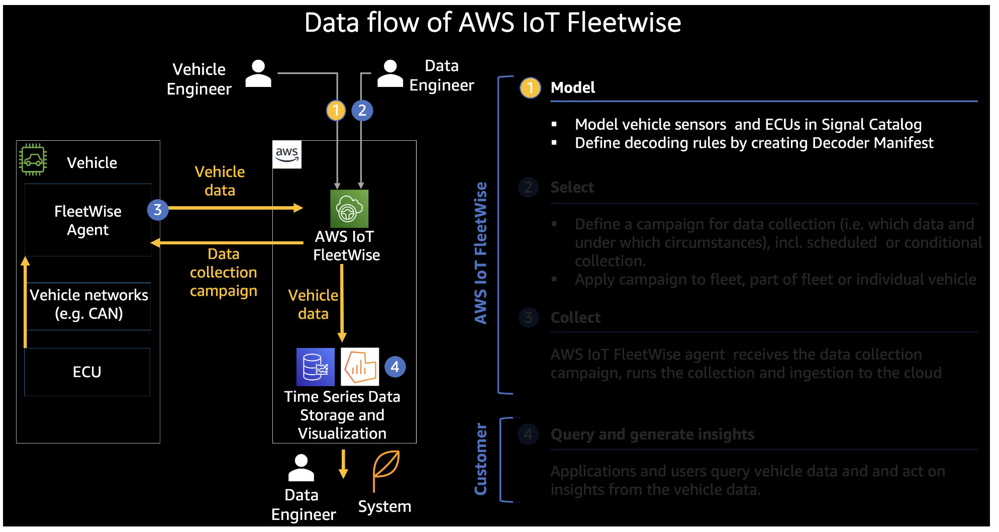

# Monitoring EV Battery Using AWS Fleetwise

## Setup 

### Create a keypair

First visit the EC2 > Key pairs > Create key pair console.

- Enter Name as fleetwise-workshop-keypair, set key pair type as RSA and set Private key file format as .pem (normally for Linux or MacOS machine) or .ppk (normally for Windows machine).\
- Click Create key pair and save fleetwise-workshop-keypair.pem file to your laptop.

### Create an EC2 instance to run the agent

For this lab we will use Cloud9, which is a cloud-based development environment, to run all the commands that will setup AWS IoT FleetWise in your account. Below, we will launch a CloudFormation template which will launch an EC2 compute instance to act as your virtual vehicle gateway. This will be used to run the FleetWise edge agent and simulate telemetry to be processed by FleetWise.

1. Select Deploy to AWS below to start the process of building infrastructure for your workshop with a CloudFormation template which will setup an EC2 Instance
   
us-east-1 -> Deploy to AWS 

2. Input fleetwise-workshop-keypair for Ec2keyPair.

3. Acknowledge checkbox for I acknowledge that AWS CloudFormation might create IAM resources. and click Create stack.

### Fleetwise

To start, we'll want to open up our Cloud9 IDE, navigate to the Cloud9 console  and select Open in Cloud9 on the tile for fleetwise-workshop.

On the bottom portion of your Cloud9 IDE, you should see a bash terminal. Run the below command to check if FleetWise commands are available in your CLI.

`aws iotfleetwise help`

### Create Timesteam DB and Table

Please run the command below in Cloud9 terminal, to create the Amazon Timestream Database and Table.

```
aws timestream-write create-database --database-name FleetWiseDatabase
aws timestream-write create-table --database-name FleetWiseDatabase --table-name FleetWiseTable
```

### Fleetwise IAM Role

Before we create the roles for FleetWise, we need to modify how Cloud9 implements credentials. First, click on the Cloud9 icon in the top left corner of your Cloud9 environment and then select Preferences. In the Preferences menu on the left hand side, select AWS Settings towards the bottom, then toggle Off the AWS managed temporary credentials option. Close out the Preferences tab.

In your AWSIoTFleetWise directory, you will have an account_registration.json file, which has the IAM role and the Timestream database information that will help register AWS IoT FleetWise in your account. But first, we will create the IAM role and policy for FleetWise to use throughout the workshop.

`cd ~/environment/AWSIoTFleetWise`

From here, run the below command in Cloud9 terminal, to create an IAM role with just the ability to assume a role from FleetWise. Copy the ARN in the output.

`aws iam create-role --role-name FleetWiseWorkshopRole --assume-role-policy-document file://trustpol.json`

To refetch the ARN, run `aws iam get-role --role-name FleetWiseWorkshopRole`

Paste the ARN in `account_registration.json`.


Register the account by running:

`aws iotfleetwise register-account --cli-input-json file://account_registration.json`

Run below command in your Cloud9 terminal after a few seconds, to check the account registration.

`aws iotfleetwise get-register-account-status`

Now, go to AWS IoT FleetWise > Settings  and check the DB/Table names and the Role ARN.


To ensure we can debug any issues that might come up during this workshop, we will enable logging for FleetWise. Click the Edit button next to AWS IoT FleetWise logging

## Modeling Vehicles

AWS IoT FleetWise provides a vehicle modeling framework that you can use to build virtual representations of your vehicles in the cloud. Signals, signal catalogs, vehicle models, and decoder manifests are the core components that you work with to model your vehicles. One of the first steps in building up your fleet is to generate a Signal Catalog. A Signal Catalog is a collection of standardised signals that can be reused to create vehicle models. AWS IoT FleetWise supports Vehicle Signal Specification (VSS)  that you can follow to define signals.

Once the signal catalog is created, a subset of Signals help create a Vehicle Model. Vehicle models enforce consistent information across multiple vehicles of the same type, so that you can process data from fleets of vehicles.



### Signal

Signals are fundamental structures that you define to contain vehicle data and its metadata. A signal can be an attribute, a branch, a sensor, or an actuator. For example, you can create a sensor to receive in-vehicle temperature values, and to store its metadata, including a sensor name, a data type, and a unit.

### Signal Catalog 

A signal catalog contains a collection of signals. Signals in a signal catalog can be used to model vehicles that use different protocols and data formats. For example, there are two cars made by different automakers: one uses the Control Area Network (CAN bus) protocol; the other one uses the On-board Diagnostics (OBD) protocol. You can define a sensor in the signal catalog to receive in-vehicle temperature values. This sensor can be used to represent the thermocouples in both cars.

#### Create a Signal Catalog 

A signal catalog is a collection of standardized signals that can be reused to create vehicle models. AWS IoT FleetWise supports Vehicle Signal Specification (VSS) that you can follow to define signals. A signal can be any of the following type:

**Attribute**

Attributes represent static information that generally doesn't change, such as manufacturer and manufacturing date.

**Branch** 

Branches represent signals in a nested structure. Branches demonstrate signal hierarchies. For example, the Vehicle branch has a child branch, Powertrain. The Powertrain branch has a child branch, combustionEngine. To locate the combustionEngine branch, use the Vehicle.Powertrain.combustionEngine expression.

**Sensor**

Sensor data reports the current state of the vehicle and change over time, as the state of the vehicle changes, such as fluid levels, temperatures, vibrations, or voltage.

**Actuator**

Actuator data reports the state of a vehicle device, such as motors, heaters, and door locks. Changing the state of a vehicle device can update actuator data. For example, you can define an actuator to represent the heater. The actuator receives new data when you turn on or off the heater.

In your Cloud9 terminal, run below command to check your signal catalog.

`aws iotfleetwise list-signal-catalogs`

Run the below command in your Cloud9 terminal, to create your Signal Catalog from the command line using the signal-catalog.json file.

```
cd ~/environment/AWSIoTFleetWise
aws iotfleetwise create-signal-catalog --cli-input-json file://signal-catalog.json
```

Make note of the ARN.

### Create a Vehicle Model

You use signals to create vehicle models that help standardize the format of your vehicles. Vehicle models enforce consistent information across multiple vehicles of the same type, so that you can process data from fleets of vehicles. Vehicles created from the same vehicle model inherit the same group of signals. For more information, see Create, provision, and manage vehicles .

Each vehicle model has a status field that contains the state of the vehicle model. The state can be one of the following values:

ACTIVE – The vehicle model is active.

DRAFT – The configuration of the vehicle model is saved.

You will find a sample vehicle model vehicle-model01.json in your AWSIoTFleetWise directory in your Cloud9 environment. Open up the file in Cloud9 and replace [REPLACE_ACCOUNT_ID] with your account ID, or the complete value of the Arn from the previous output.

Run below command in your Cloud9 terminal, to create your vehicle model

`aws iotfleetwise create-model-manifest --cli-input-json file://vehicle-model01.json`

Run below command in your Cloud9 terminal, to get the vehicle model details .

`aws iotfleetwise get-model-manifest --name awsiotforauto-evdemo-fleetwise-vehicle-model01`

You will find "status": "DRAFT" in the above output. Run the below command in Cloud9 terminal, to activate the model.

`aws iotfleetwise update-model-manifest --name awsiotforauto-evdemo-fleetwise-vehicle-model01 --status ACTIVE`

Run below command in Cloud9 terminal, to verify that the model is active. Also, make note of the value of "arn" from the output.

`aws iotfleetwise get-model-manifest --name awsiotforauto-evdemo-fleetwise-vehicle-model01`

Repeat this same procedure for vehicle-model02.json. Edit the file to replace your account ID

### Create a Decoder Manifest

Decoder manifests contain decoding information that AWS IoT FleetWise uses to transform vehicle data (binary data) into human-readable values and to prepare your data for data analyses. Network interface and decoder signals are the core components that you work with to configure decoder manifests.

Network interface
Contains information about the protocol that the in-vehicle network uses. AWS IoT FleetWise supports the following protocols.

Controller Area Network (CAN bus)
A protocol that defines how data is communicated between electronic control units (ECUs). ECUs can be the engine control unit, airbags, or the audio system.

On-board diagnostic (OBD) II
A further developed protocol that defines how self-diagnostic data is communicated between ECUs. It provides a number of standard diagnostic trouble codes (DTCs) that help identify what is wrong with your vehicle.

Decoder signal
Provides detailed decoding information for a specific signal. Every signal specified in the vehicle model must be paired with a decoder signal. If the decoder manifest contains CAN network interfaces, it must contain CAN decoder signals. If the decoder manifest contains OBD network interfaces, it must contain OBD decoder signals.

Each decoder manifest must be associated with a vehicle model. AWS IoT FleetWise uses the associated decoder manifest to decode data from vehicles created based on the vehicle model.

Each decoder manifest has a status field that contains the state of the decoder manifest. The state can be one of the following values:

ACTIVE – The decoder manifest is active.

DRAFT – The configuration of the decoder manifest isn't saved.

The below decoder manifest is created for you in your AWSIoTFleetWise directory as decoder-manifest1.json We will use this file to create a Decoder Manifest using the CLI.

In the decoder manifest, we define one CAN Bus Network Interface with a name myVirtualCANNetworkInterface and a secondary OBD interface named myVirtualobdInterface. After that, we have entered the Signal decoding rules for each of the signals we want to model.

The decoding rules for CAN Networks consists of entering the bit encoding of each signal into a CAN Frame. Typically this is extracted from a CAN DBC file. For this workshop, we will limit our manifest to just the signals as defined in the catalog.

Open decoder-manifest1.json in your Cloud9 environment and replace [REPLACE_ACCOUNT_ID] with your account ID or replace the entire arn with actual value from the previous output when the vehicle model was created. Save the file then return to your terminal.

Run the below command in Cloud9 terminal, to first create the decoder manifest, then associate the Decoder Manifest with the Vehicle Model.

`aws iotfleetwise create-decoder-manifest --cli-input-json file://decoder-manifest1.json`

Run the below command in Cloud9 terminal, to validate that our Decoder Manifest has been created and also check which signal decoding rules are set. Press q to exit if you do not review the entire decoding rules.

`aws iotfleetwise list-decoder-manifest-signals --name awsiotforauto-evdemo-fleetwise-decoder-manifest1`


By default the Decoder Manifest resource is created in a DRAFT mode. Run below command in your Cloud9 terminal, to activate the decoder.

`aws iotfleetwise update-decoder-manifest --name awsiotforauto-evdemo-fleetwise-decoder-manifest1 --status ACTIVE`

Run the below command in Cloud9 terminal, to verify that the Decoder is active.

`aws iotfleetwise get-decoder-manifest --name awsiotforauto-evdemo-fleetwise-decoder-manifest1`

Repeat with decoder-manifest2.json.

## Creating Vehicles

Vehicles are instances of vehicle models. Vehicles must be created from a vehicle model and associated with a decoder manifest. Vehicles uploads one or more data streams to the cloud. For example, a vehicle can send mileage, engine temperature, and state of heater data to the cloud. Every vehicle contains the following information:

**vehicleName**

An ID that identifies the vehicle.

WARNING: Do not add personally identifiable information (PII) or other confidential or sensitive information in your vehicle name. Vehicle names are accessible by other AWS services, including Amazon CloudWatch. Vehicle names aren't intended to be used for private or sensitive data.
modelManifestARN

The Amazon Resource Name (ARN) of a vehicle model (model manifest). Every vehicle is created from a vehicle model. Vehicles created from the same vehicle model consist of the same group of signals inherited from the vehicle model. These signals are defined and standardized in the signal catalog.

**decoderManifestArn**

The ARN of the decoder manifest. A decoder manifest provides decoding information that AWS IoT FleetWise can use to transform raw signal data (binary data) into human-readable values. A decoder manifest must be associated with a vehicle model. AWS IoT FleetWise uses the same decoder manifest to decode raw data from vehicles created based on the same vehicle model.

**attributes**

Attributes are key-value pairs that contain static information. Vehicles can contain attributes inherited from the vehicle model. You can add additional attributes to distinguish an individual vehicle from other vehicles created from the same vehicle model. For example, if you have a black car, you can specify the following value for an attribute: {"color": "black"}.

### Create an IoT Thing

The AWS IoT FleetWise Edge Agent software running in your vehicle collects and transfers data to the cloud. AWS IoT FleetWise integrates with AWS IoT Core to support secure communication between the Edge Agent software and the cloud through MQTT. Each vehicle corresponds to an AWS IoT thing. You can use an existing AWS IoT thing to create a vehicle or set AWS IoT FleetWise to automatically create an AWS IoT thing for your vehicle. For more information, see Create a vehicle (AWS CLI).

The following topics are reserved for use by AWS IoT FleetWise. You can subscribe and publish to reserved topics as they allow. However, you can't create new topics that begin with a dollar sign ($). Unsupported publish or subscribe operations to reserved topics can result in a terminated connection


AWS IoT Core supports authentication and authorization that help securely control access to AWS IoT FleetWise resources. Vehicles can use X.509 certificates to get authenticated (signed in) to use AWS IoT FleetWise and AWS IoT Core polices to get authorized (have permissions) to perform specified actions.

In Cloud9 terminal, please run below command to create your the IoT Things to correspond to your vehicles.

```
aws iot create-thing --thing-name FleetWiseWorkshopVehicle01
aws iot create-thing --thing-name FleetWiseWorkshopVehicle02
```

Run the below command in Cloud9 terminal, to check your 12 digit account number.

`aws sts get-caller-identity`

Edit the policy.json file found in your AWSIoTFleetWise directory in your Cloud9 instance. replace all occurances of [REPLACE_ACCOUNT_ID] with your 12-digit account number determined from the prior command.

Run the below command in your Cloud9 terminal, to create the IoT Policy.

`aws iot create-policy --policy-name "FleetWiseWorkshop-Thing-Policy" --policy-document file://policy.json`

Run the below command in your Cloud9 terminal, to create the private/public key and certificate for the IoT Thing.

`aws iot create-keys-and-certificate     --set-as-active     --certificate-pem-outfile FleetWiseWorkshopCert.pem     --public-key-outfile FleetWiseWorkshopPublicKey.key --private-key-outfile FleetWiseWorkshopPrivateKey.key`

Copy the value of "certificateArn" from the output.

Run the below command in Cloud9 terminal, to attach the Policy to the certificate and attach the Certificate principal to the thing. Please replace with [value of certificateArn] with value of "certificateArn" from the previous output.

`aws iot attach-policy --policy-name "FleetWiseWorkshop-Thing-Policy" --target "[value of certificateArn]"`

A successful run of attach-policy command will result in no output message.

```
aws iot attach-thing-principal --thing-name "FleetWiseWorkshopVehicle01" --principal "[value of certificateArn]"
aws iot attach-thing-principal --thing-name "FleetWiseWorkshopVehicle02" --principal "[value of certificateArn]"
```

## Vehicle Provisioning

In your Cloud9 environment open vehicle01.json.

Replace [REPLACE_ACCOUNT_ID] with your 12 digit account number.

Please run below command in Cloud9 terminal, to create the vehicle on AWS IoT FleetWise.

`aws iotfleetwise create-vehicle --cli-input-json file://vehicle01.json`

Repeat that same process for vehicle02.json. Remember to replace the account id in the json file.

`aws iotfleetwise create-vehicle --cli-input-json file://vehicle02.json`

### Fleet Provisioning and Vehicle Association on AWS IoT FleetWise

Vehicles can be associated with one or more fleets. Fleets are targets to data collection campaigns deployment. For this workshop, we will create a single fleet for both vehicles.

Run below command in Cloud9 terminal, to create a fleet. Replace the [REPLACE_ACCOUNT_ID] with your 12 digit account number.

`aws iotfleetwise create-fleet --fleet-id aws-iot-for-automotive-fleet --description "AWS IoT for Automotive FleetWiseWorkshop Fleet" --signal-catalog-arn "arn:aws:iotfleetwise:us-east-1:[REPLACE_ACCOUNT_ID]:signal-catalog/awsiotforauto-evdemo-fleetwise-signal-catalog"`

067035743785

Run below commands in Cloud9 terminal, to associate the vehicles with the fleet.

```
aws iotfleetwise associate-vehicle-fleet --fleet-id aws-iot-for-automotive-fleet --vehicle-name "FleetWiseWorkshopVehicle01"
aws iotfleetwise associate-vehicle-fleet --fleet-id aws-iot-for-automotive-fleet --vehicle-name "FleetWiseWorkshopVehicle02"
```
If processed normally, nothing will be output as a result of the above command.

Please run below command in Cloud9 terminal, to validate that the vehicle has been associated with the fleet.

`aws iotfleetwise list-vehicles-in-fleet --fleet-id aws-iot-for-automotive-fleet`

## Vehicle Edge Agent Setup

AWS IoT FleetWise Edge Agent is a native Linux application  that supports Armv8 CPU architecture. To get as closer as possible to a Vehicle ECU architecture, we will build and run AWS IoT FleetWise Edge on a EC2 Graviton  machine.

AWS IoT FleetWise Edge receives two documents:

Decoder Manifest - this document describes how signals are collected from the vehicle, and will include details such as, but not limited to: Bus ID, network name, decoding information, etc.

Data Collection Schemes - this document describes what signals to collect. It also describes the condition logic that defines the enablement of the trigger logic that allows these signals to be collected, for example, when Vehicle Speed > 100 km/Hr and Driver Seatbelt is Off and Ambient Temperature < 0 degree C.

### AWS IoT FleetWise Edge Deployment & Supported Platforms

AWS IoT FleetWise Edge functional flexibility and its use of dynamic memory allocation means that it cannot reside in the real-time safe vehicle ECUs. AWS IoT FleetWise Edge must also be connected to the internet and preferably have access to a “good” portion of vehicle ECU data. OEMs have the flexibility to decide where they can deploy AWS IoT FleetWise Edge binary. Possible options include (if present):

- Vehicle Gateway (such as the NXP S32G)
- Vehicle Head Unit or IVI
- Vehicle’s High Performance Computer
- Telematics Control Unit (TCU)

AWS IoT FleetWise Edge was built and tested on 64-bit architectures. It has been tested on both ARM and X86 multicore based machines, with a Linux Kernel version of 5.4 and above. The kernel module for ISO-TP (can-isotp ) would need to be installed in addition for Kernels below 5.10.

### AWS IoT FleetWise Client-Server Communication
AWS IoT FleetWise Edge relies on AWS SDK for C++ to send and receive data from and to AWS IoT FleetWise Server. All data sent to AWS IoT is sent over an encrypted TLS connection using MQTT, HTTPS, and WebSocket protocols, making it secure by default while in transit. AWS IoT FleetWise uses MQTT quality of service zero (QoS = 0).

## EC2 Gravitron 2

Open up your EC2 console . Select the EC2 instance named "FleetWiseEdgeAgent-"AWSIoTForAuto-FleetWise-Ec2-Instance" and then click Connect.

Select SSH Client tab and follow the steps included to connect to the EC2 instance. This EC2 instance will be acting as your AWS IoT FleetWise Edge Agent, impersonting a vehicle gateway that has access to the vehicle's CAN BUS. To connect, you will use an SSH client or just your Terminal or Command prompt in your MacOS or Windows machine.

cd to downloads and run `chmod 400 fleetwise-workshop-keypair.pem`

Let's go into the FleetWise edge folder to configure and build the agent:

`cd aws-iot-fleetwise-edge/`

Create the configuration directory.

`sudo mkdir -p /etc/aws-iot-fleetwise`

Create the persistency directories.

```
sudo mkdir -p /var/aws-iot-fleetwise/fwe0
sudo mkdir -p /var/aws-iot-fleetwise/fwe1
```

To properly configure the Edge Agent, we will run two commands to create two configuration files that will be stored in /etc/aws-iot-fleetwise directory. To ensure the Edge Agent is pointed to the correct IoT account endpoint, we need to get the endpoint. Switch back over to your Cloud9 instance, and your Cloud9 terminal in your browser. From the command line there, run the below command and copy and replace the [your_IoT_Core_endpoint] with the entire string. The easiest place to make these types of modifications is in your Cloud9 instance, opening up a new text file.

`aws iot describe-endpoint --endpoint-type "iot:Data-ATS"`

Create the config file that the AWS IoT FleetWise Edge software will use. The following script simply substitutes the settings for the private key, certificate, IoT Endpoint and the CAN Bus in the static config file.

```
 sudo ./tools/configure-fwe.sh \
  --input-config-file configuration/static-config.json \
  --output-config-file /etc/aws-iot-fleetwise/config-0.json \
  --vehicle-name FleetWiseWorkshopVehicle01 \
  --endpoint-url [your_IoT_Core_endpoint] \
  --can-bus0 vcan0 \
  --persistency-path "/var/aws-iot-fleetwise/fwe0";
```

We will also configure the secondary vehicle by changing the vehicle name in the parameters as seen below:

```
 sudo ./tools/configure-fwe.sh \
  --input-config-file configuration/static-config.json \
  --output-config-file /etc/aws-iot-fleetwise/config-1.json \
  --vehicle-name FleetWiseWorkshopVehicle02 \
  --endpoint-url [your_IoT_Core_endpoint] \
  --can-bus0 vcan0 \
  --persistency-path "/var/aws-iot-fleetwise/fwe1";
```

After you have created your configuration files, build the AWS IoT FleetWise Edge binary by running this script on your Edge Agent EC2 instance. This will take just over a minute. Take a sip of water and enjoy your break.

When your commands have the proper IoT Core endpoints, run the configure script in your Graviton instance for both Vehicles. This command will create two configuration files in the /etc/aws-iot-fleetwise directory.

`./tools/build-fwe-native.sh`


Now that your Edge Agent is built, we are almost ready to start running the Agent to connect to AWS IoT Core. First we need to head back over to our Cloud9 instance in your browser and download the public/private key the Agent will use to authenticate to the IoT Core endpoint.

Switch back to your cloud9 instance and download FleetWiseWorkshopCert.pem and FleetWiseWorkshopPrivateKey.key and save them in the same folder which has fleetwise-workshop-keypair.pem (or fleetwise-workshop-keypair.ppk).

```
scp -i "fleetwise-workshop-keypair.pem" FleetWiseWorkshopCert.pem ubuntu@ec2-3-91-38-218.compute-1.amazonaws.com:/home/ubuntu
scp -i "fleetwise-workshop-keypair.pem" FleetWiseWorkshopPrivateKey.key ubuntu@ec2-3-91-38-218.compute-1.amazonaws.com:/home/ubuntu
```

Now that you have uploaded your public/private key pair, go back to your Graviton instance terminal and run the below commands to copy the private key and the certificate of the vehicle we provisioned previously into /etc/aws-iot-fleetwise where your FleetWise configuration is looking for these two files.

```
sudo cp  ~/FleetWiseWorkshopPrivateKey.key /etc/aws-iot-fleetwise/private-key.key
sudo cp  ~/FleetWiseWorkshopCert.pem /etc/aws-iot-fleetwise/certificate.pem
```

Install the service with the below command. The AWS IoT FleetWise Edge service will be started as a SystemD service.

`sudo ./tools/install-fwe.sh`

The below command will allow you to print the logs of the FleetWise Edge agent to the screen. Ctrl + C to stop viewing.

`sudo journalctl -fu fwe@0`

The following commands are useful for debugging or starting and stopping the service:

```
sudo ./tools/deploy/stop-fwe.sh
sudo ./tools/deploy/start-and-enable-fwe.sh
```

Congratulations, the Edge Agent is setup successfully. Now let's setup some campaigns to send to the edge device to collect some data. Switch back over to your Cloud9 environment in your browser to setup the campaigns.

## Select and Collect Vehicle Data

A campaign is an orchestration of data collection rules. Campaigns give the AWS IoT FleetWise Edge Agent software instructions on how to select, collect, and transfer data to the cloud.

You create campaigns in the cloud. After you or your team has approved campaigns, AWS IoT FleetWise automatically deploys them to vehicles. You can choose to deploy a campaign to a vehicle or a fleet of vehicles. The Edge Agent software doesn't start collecting data until a running campaign is deployed to the vehicle.

       Note: Campaigns won't work until you have the following:

- The Edge Agent software is running in your vehicle.
- You must set up AWS IoT Core to provision your vehicle.

### Setup Fleetwise Campaigns

Each campaign will require an active signal catalog and a target fleet. We need to modify the main file to include the Fleet ARN and the Signal Catalog Arn that we created earlier in the lab. You will find two campaign files in your AWSIoTFleetWise folder: conditional-snapshot-campaign.json and continuous-monitoring-campaign.json. Each file we will edit and replace the signalCatalogArn and the targetArn with your Signal Catalog Arn and your Fleet Arn.

To do this, open each file in your Cloud9 IDE and edit the file point to the signal catalog and fleet you setup earlier in this workshop. To retreieve your Signal Catalog Arn and your Fleet Arn's, run the commands below.

```
aws iotfleetwise list-signal-catalogs
aws iotfleetwise get-fleet --fleet-id aws-iot-for-automotive-fleet
```

To only get your account number, please run below command in Cloud9 terminal.

`aws sts get-caller-identity`

Once the campaign json files have all been edited and saved, run the below command in your Cloud9 terminal, to create the campaign

#### Campaign 1: Continuously collect battery pack current and cell temperature

`aws iotfleetwise create-campaign --name awsiotforauto_fleetwide_continuous_monitoring --cli-input-json file://continuous-monitoring-campaign.json`

#### Campaign 2: Conditionally collect a high-resolution (50 ms sampling rate) snapshot of multiple Battery Management System (BMS) signals.

`aws iotfleetwise create-campaign --name awsiotforauto_fleetwide_conditional_analysis --cli-input-json file://conditional-snapshot-campaign.json`

Please run below command in Cloud9 terminal, to verify that both campaigns are created by listing them.

`aws iotfleetwise list-campaigns`


In your Cloud9 terminal, please run below command to check the status of the campaigns that we created.

```
aws iotfleetwise get-vehicle-status --vehicle-name FleetWiseWorkshopVehicle01
aws iotfleetwise get-vehicle-status --vehicle-name FleetWiseWorkshopVehicle02
```

Please deploy the issue based campaign. We do that using the update-campaign API and use the Approve status

```
aws iotfleetwise update-campaign \
            --name awsiotforauto_fleetwide_continuous_monitoring \
            --action APPROVE
```

```
aws iotfleetwise update-campaign \
            --name awsiotforauto_fleetwide_conditional_analysis \
            --action APPROVE
```

Check the status again:

```
aws iotfleetwise get-vehicle-status --vehicle-name FleetWiseWorkshopVehicle01
aws iotfleetwise get-vehicle-status --vehicle-name FleetWiseWorkshopVehicle02
```

Your campaigns have been delivered to your edge device, now let's setup your simulated data that will be sent to the virtual CAN interface. So let's switch back over to your terminal that is SSH'd into your EC2 FleetWise Graviton terminal instance.

## Simulated CAN Battery Data

With the cloud and edge side of FleetWise setup and ready to receive data, we will start a program that will take contents of a CSV and publish them to the virtual CAN interface. It will continuously loop over this set of data and you will then be able to run queries in Timestream and eventually on Grafana.

First step is to return to your EC2 FleetWise Graviton terminal window where your Edge Agent is currently running and listening for CAN frames.

`cd ~/aws-iot-fleetwise-evbatterymonitoring/simulatedvehicle/canreplay/service`

The following command will start the simulation. We have included a few additional scripts if you want to take the time to setup the simulation as a system service, those commands are included below.

`./start_simulation.sh FleetWiseWorkshopVehicle01`

You should start to see the script begin to loop through the file and post messages to the virtual CAN

You will also see (if you have two terminal windows open), the Continuous Monitoring campaign being triggered via the AWS FleetWise Edge agent

`./start_simulation.sh FleetWiseWorkshopVehicle02`


For more long term service implementation while you work on your DBC files and decoder manfiests, you can setup AWS IoT FleetWise simulator as a system service by running the below commands

`./install_service.sh FleetWiseWorkshopVehicle02`

You can now start/stop the EV simulation service using the following commands

```
sudo systemctl start evcansimulation.service
sudo systemctl stop evcansimulation.service
```

A few other commands that can be helpful when debugging the service or visualizing the logs are below

```
sudo journalctl -fu fwe@0 #print FleetWise Edge Agent logs to screen
cat /var/log/cloud-init-output.log #view FleetWise Edge Agent setup logs
sudo journalctl -fu evcansimulation #view simulation logs (if setup as a system service)
./tools/deploy/stop.fwe.sh #stops fleetwise edge service
./tools/deploy/start-and-enable-fwe.sh #starts and enables FW Edge Agent at startup
```

## Review Simulated Data

In this step, you will review the results of the data collection campaigns stored in the Amazon Timestream table.

1. Open the Amazon Timestream Console by navigating to the Amazon Timestream  service in AWS management console. Next, select the Query editor on the left-hand side menu.

2. Review vehicle data collected by campaign 1 “Continuously collect battery pack current and cell temperature”
   
In the text field for the query, enter the following sample query and choose Run:

```
SELECT time, vehicleName, measure_name, measure_value::double, VehicleVIN
FROM "FleetWiseDatabase"."FleetWiseTable"
WHERE campaignName = 'awsiotforauto_fleetwide_continuous_monitoring' AND
      time between ago(15m) and now()
ORDER BY time DESC LIMIT 10
```

In spite of the fact that both vehicles encode the CAN message for the signal EVBatterySample.BMS.BatteryPack01.ShuntPlusCurrent_a in different ways (see DBC files for vehicle 1 and vehicle 2), you can access and analyze the vehicle data under a homogenous signal catalog.

In the next steps of the lab shortly, you will generate these EV monitoring dashboards based on these results.

3. Review vehicle data collected by campaign 2

Let’s query the statistics of a specific cell temperature. Enter the following query and select Run:

```
SELECT vehicleName, measure_name,
       hour(time) as hour, minute(time) as minute,
       max(measure_value::double) as MaxTemperature,
       min(measure_value::double) as MinTemperature
FROM "FleetWiseDatabase"."FleetWiseTable"
WHERE campaignName = 'awsiotforauto_fleetwide_conditional_analysis'
      AND measure_name = 'EVBatterySample.BMS.BatteryPack01.Cell001.CellTemperature'
      AND (time between ago(10m) and now())
GROUP by vehicleName, measure_name, hour(time), minute(time)
ORDER by vehicleName,hour(time), minute(time)
```

