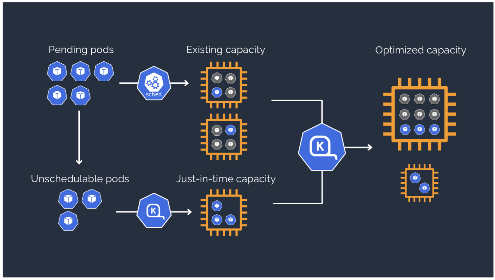

# Concepts to take your Kubernetes operations and scale to the next level

Karpenter - AWS Open Source 

## ENV Setup

```
echo "export KUBECTL_VERSION='1.23.7'" >>  ~/.bash_profile
echo "export KUBERNETES_VERSION='1.23'" >>  ~/.bash_profile
echo "export LBC_VERSION='v2.4.1'" >>  ~/.bash_profile
echo "export CLUSTER_IAM_ROLE_NAME='Cloud9InstanceRole'" >>  ~/.bash_profile
echo "export KARPENTER_VERSION=v0.18.1" >> ~/.bash_profile
echo "export CLUSTER_NAME='${USER}-karpenter-demo'" >> ~/.bash_profile

source ~/.bash_profile
```

### Install Kubectl

```
sudo curl --location -o /usr/local/bin/kubectl "https://s3.us-west-2.amazonaws.com/amazon-eks/$KUBECTL_VERSION/2022-06-29/bin/linux/amd64/kubectl"
sudo chmod +x /usr/local/bin/kubectl
kubectl version --client
```

### Install Helm

```
curl -sSL https://raw.githubusercontent.com/helm/helm/master/scripts/get-helm-3 | bash
helm version --short
```

### AWS CLI V2 setup

```
# Upgrade AWS CLI according to guidance in AWS documentation .
curl "https://awscli.amazonaws.com/awscli-exe-linux-x86_64.zip" -o "awscliv2.zip"
unzip awscliv2.zip
sudo ./aws/install
aws --version
. ~/.bash_profile

# Setup AWS account environment variable
echo "export AWS_ACCOUNT_ID=$(aws sts get-caller-identity --output text --query Account)"  >>  ~/.bash_profile
echo "export AWS_DEFAULT_REGION=us-east-2"  >>  ~/.bash_profile
.  ~/.bash_profile
echo "export AZS=($(aws ec2 describe-availability-zones --query 'AvailabilityZones[].ZoneName' --output text --region $AWS_DEFAULT_REGION))"  >>  ~/.bash_profile
.  ~/.bash_profile
source ~/.bash_profile
aws configure set default.region ${AWS_DEFAULT_REGION}
aws configure get default.region

test -n "$AWS_ACCOUNT_ID" && echo AWS_ACCOUNT_ID is "$AWS_ACCOUNT_ID" || echo AWS_ACCOUNT_ID is not set
test -n "$AWS_DEFAULT_REGION" && echo AWS_DEFAULT_REGION is "$AWS_DEFAULT_REGION" || echo AWS_DEFAULT_REGION is not set

# Echo important Karpenter environment variables
echo $KARPENTER_VERSION $CLUSTER_NAME $AWS_DEFAULT_REGION $AWS_ACCOUNT_ID
```

### jq setup

```
sudo yum -y install jq
```

### eksctl setup

```
curl --silent --location "https://github.com/weaveworks/eksctl/releases/latest/download/eksctl_$(uname -s)_amd64.tar.gz" | tar xz -C /tmp
sudo mv -v /tmp/eksctl /usr/local/bin
eksctl version
```

### Create IAM Role and Attach to Cloud9 EC2 Instance

Follow [this link](https://us-east-1.console.aws.amazon.com/iamv2/home?region=us-east-2#/roles/create?commonUseCase=EC2&step=addPermission&trustedEntityType=AWS_SERVICE) to create an IAM role with Administrator access.

Confirm that AWS service and EC2 are selected, then click Next to view permissions.

Enter AdministratorAccess and select it, then click Next to specify role name.

Enter Cloud9InstanceRole for the Name, and click Create role.


1. Click the gray circle on the right-hand side of the Cloud9 IDE and select Manage EC2 Instance as shown below.
2. This will display the EC2 console. Select the instance and choose Actions / Security / Modify IAM Role.
3. Choose Cloud9InstanceRole from the IAM Role drop down, and select Update IAM role.
4. In Cloud9 IDE ensure temporary credentials aren't already in place. Remove any existing credentials file as well as disabling AWS managed temporary credentials using the following commands in the terminal:

```
aws cloud9 update-environment  --environment-id $C9_PID --managed-credentials-action DISABLE
rm -vf ${HOME}/.aws/credentials
```

Use the GetCallerIdentity CLI command to validate that the Cloud9 IDE is using the correct IAM role. Enter Ctrl-C to break out of the result/response.

```
aws sts get-caller-identity
```

### Launch EKS Cluster

Open a new terminal window by selecting Window / New Terminal to perform the next step that is creating an Amazon EKS Cluster, using the eksctl  command line. This solution allows for manifest files to be defined to configure the Amazon EKS cluster. Create the cluster using the inlined manifest below in the new terminal window.

```
eksctl create cluster -f - << EOF
---
apiVersion: eksctl.io/v1alpha5
kind: ClusterConfig
metadata:
  name: ${CLUSTER_NAME}
  region: ${AWS_DEFAULT_REGION}
  version: "1.23"
  tags:
    karpenter.sh/discovery: ${CLUSTER_NAME}
managedNodeGroups:
  - instanceType: m5.large
    amiFamily: AmazonLinux2
    name: ${CLUSTER_NAME}-ng
    desiredCapacity: 2
    minSize: 1
    maxSize: 10
iam:
  withOIDC: true
EOF

echo "export CLUSTER_ENDPOINT='$(aws eks describe-cluster --name ${CLUSTER_NAME} --query 'cluster.endpoint' --output text)'" >> ~/.bash_profile 
source ~/.bash_profile
```

Once the eksctl command is complete, you should be able to validate the cluster is running by using the following command: `kubectl get nodes`


#### Configuration File Overview

eksctl supports the use of CLI invocations but also supports the use of a configuration file  as input. The following provides the sample that was used to start the Amazon EKS cluster:

```
apiVersion: eksctl.io/v1alpha5
kind: ClusterConfig
metadata:
  name: ${CLUSTER_NAME}
  region: ${AWS_DEFAULT_REGION}
  version: "1.23"
  tags:
    karpenter.sh/discovery: ${CLUSTER_NAME}
managedNodeGroups:
  - instanceType: m5.large
    amiFamily: AmazonLinux2
    name: ${CLUSTER_NAME}-ng
    desiredCapacity: 2
    minSize: 1
    maxSize: 10
iam:
  withOIDC: true
```

For the above example, the configuration file specifies the following information:

name - this is the name of the cluster

region - region the cluster is to be deployed in

version - version of Amazon EKS cluster to be created

tags - custom tags, in this case Karpenter to be used in scalability lab
managed node group details

instance type - instance type to be used for managed node group

ami family - AMI family to be used for managed node group
managed node group name

desired capacity - starting managed node group size

min size - minimum size of cluster

max size - maximum size of cluster

withOIDC - Enable withOIDC to automatically create an IRSA for the amazon CNI plugin and limit permissions granted to nodes in your cluster, instead granting the necessary permissions only to the CNI service account.

#### Enable Cluster Logging

1. To enable Amazon EKS control plane logging on an existing cluster we will leverage the eksctl command line. Review the eksctl.io documentation for the five different types of logs that can be generated here: [eksctl](https://eksctl.io/usage/cloudwatch-cluster-logging/)

2. Execute the following command in the Cloud9 terminal to enable logging.

`eksctl utils update-cluster-logging --enable-types api,audit,authenticator --cluster $CLUSTER_NAME --approve`


## Part 1 - Scalability

In this laboratory, the focus will be on examining best practices for Cluster AutoScaling from the Amazon EKS Best Practices GitHub repository: https://aws.github.io/aws-eks-best-practices/karpenter/ . Specifically the lab will install, configure and execute just-in-time node provisioning using the open source project Karpenter . The labs will also examine the flexibility of the Provisioner CRD and its ability to help optimize Amazon EKS node creation and deletion along with many other features.

### Karpenter

Karpenter is an open-source cluster autoscaler that automatically provisions nodes based on unscheduled pods as described here . What is unique about Karpenter is that the project has intimate knowledge of the family of EC2 instances available (e.g. over 500) and leverages this to support optimizations on cost, spread of pods, and bin packing to name a few. Using a Provisioner CRD, Karpenter can be configured to increase the utilization across the nodes and do so with the least amount of cost. The following image shows how Karpenter focuses on node scheduling to help create an optimized cluster:



The following example will help install, configure and test Karpenter v0.18.1 in action with a focus of demonstrating:

- Configure a Provisioner CRD
- Scale deployments to invoke the Provisioner policy when limit is reached on CPU
- Examine the node creation events in Karpenter controller logs
- Determine where pods are being placed on nodes
- Examine the optimization of node sizing
- Delete deployments to invoke a down sizing of nodes and re-examine pod placement

#### Steps

1. Following the instructions [documented here](https://karpenter.sh/v0.18.1/getting-started/getting-started-with-eksctl/),the eks cluster has already been created and we can now enable the roles and subsequent permissions Karpenter will need. First we create the KarpenterNode IAM Resources via CloudFormation that updates an InstanceProfile providing permissions to run containers and configure networking.

```
TEMPOUT=$(mktemp)

curl -fsSL https://karpenter.sh/"${KARPENTER_VERSION}"/getting-started/getting-started-with-eksctl/cloudformation.yaml  > $TEMPOUT \
&& aws cloudformation deploy \
  --stack-name "Karpenter-${CLUSTER_NAME}" \
  --template-file "${TEMPOUT}" \
  --capabilities CAPABILITY_NAMED_IAM \
  --parameter-overrides "ClusterName=${CLUSTER_NAME}"
```

Next access is granted to instances using the profile to connect to the cluster via update to the aws-auth configmap. This allows Karpenter to launch new EC2 instances that are connected to the cluster.

```
eksctl create iamidentitymapping \
  --username system:node:{{EC2PrivateDNSName}} \
  --cluster "${CLUSTER_NAME}" \
  --arn "arn:aws:iam::${AWS_ACCOUNT_ID}:role/KarpenterNodeRole-${CLUSTER_NAME}" \
  --group system:bootstrappers \
  --group system:nodes

```

2. Next create the KarpenterController IAM Role using IRSA (IAM Roles for Service Based Accounts. Karpenter requires permissions to launch instances

```
eksctl create iamserviceaccount \
  --cluster "${CLUSTER_NAME}" --name karpenter --namespace karpenter \
  --role-name "${CLUSTER_NAME}-karpenter" \
  --attach-policy-arn "arn:aws:iam::${AWS_ACCOUNT_ID}:policy/KarpenterControllerPolicy-${CLUSTER_NAME}" \
  --role-only \
  --approve

export KARPENTER_IAM_ROLE_ARN="arn:aws:iam::${AWS_ACCOUNT_ID}:role/${CLUSTER_NAME}-karpenter"
```

3. Create the EC2 Spot Service Linked Role:

```
aws iam create-service-linked-role --aws-service-name spot.amazonaws.com || true
# If the role has already been successfully created, you will see:
# An error occurred (InvalidInput) when calling the CreateServiceLinkedRole operation: Service role name AWSServiceRoleForEC2Spot has been taken in this account, please try a different suffix.
```

4. Deploy Karpenter to the EKS Cluster using Helm chart. This chart will include cluster details and the Karpenter Role ARN:

```
helm upgrade --install karpenter oci://public.ecr.aws/karpenter/karpenter --version ${KARPENTER_VERSION} --namespace karpenter --create-namespace \
  --set serviceAccount.annotations."eks\.amazonaws\.com/role-arn"=${KARPENTER_IAM_ROLE_ARN} \
  --set clusterName=${CLUSTER_NAME} \
  --set clusterEndpoint=${CLUSTER_ENDPOINT} \
  --set aws.defaultInstanceProfile=KarpenterNodeInstanceProfile-${CLUSTER_NAME} \
  --wait # for the defaulting webhook to install before creating a Provisioner
```

Using the following command to confirm helm application is deployed:

`helm list -n karpenter`

This will create a karpenter namespace with a pod per node.

`kubectl get namespace`

`kubectl get pods -n karpenter`

5. (Optional)Deploy the AWS Node Termination Handler to handle Spot interruptions gracefully

```
helm repo add eks https://aws.github.io/eks-charts
helm repo update

helm upgrade --install --namespace aws-node-termination-handler --create-namespace \
  aws-node-termination-handler eks/aws-node-termination-handler \
    --set enableSpotInterruptionDraining="true" \
    --set enableRebalanceMonitoring="true" \
    --set enableRebalanceDraining="true" \
    --set enableScheduledEventDraining="true" \
    --set nodeSelector."karpenter\.sh/capacity-type"=spot
```

6. Deploy a Provisioner manifest to Amazon EKS:

```
cat <<EOF | kubectl apply -f -
apiVersion: karpenter.sh/v1alpha5
kind: Provisioner
metadata:
  name: default
spec:
  requirements:
    - key: karpenter.sh/capacity-type
      operator: In
      values: ["on-demand"]
  limits:
    resources:
      cpu: 1000
  providerRef:
    name: default
  ttlSecondsAfterEmpty: 30
---
apiVersion: karpenter.k8s.aws/v1alpha1
kind: AWSNodeTemplate
metadata:
  name: default
spec:
  subnetSelector:
    karpenter.sh/discovery: ${CLUSTER_NAME}
  securityGroupSelector:
    karpenter.sh/discovery: ${CLUSTER_NAME}
EOF
```

7. Create a deployment within Amazon EKS:

```
cat <<EOF | kubectl apply -f -
apiVersion: apps/v1
kind: Deployment
metadata:
  name: inflate
spec:
  replicas: 0
  selector:
    matchLabels:
      app: inflate
  template:
    metadata:
      labels:
        app: inflate
    spec:
      terminationGracePeriodSeconds: 0
      containers:
        - name: inflate
          image: public.ecr.aws/eks-distro/kubernetes/pause:3.2
          resources:
            requests:
              cpu: 1
EOF
```

8. Scale the replicas to create a scaling event, that in turn will introduce additional two nodes to the cluster.

`kubectl scale deployment inflate --replicas 5`

9. To monitor the change, use the following commands to see the activity in the logs:

`kubectl logs -f -n karpenter -l app.kubernetes.io/name=karpenter -c controller`

The output of this call will share the state of the cluster.

10. Examine the number of nodes using the following command:

`kubectl get nodes`

11. Review the pods and identify which EC2 instances they have been deployed on:

`kubectl get pods`

Once we have the pods, we can then describe them to identity the actual node that a pod is located on:

`kubectl describe pods <pod_name>`

12. Go to EC2 Instances and check the instance types employed. Using the Provisioner manifest, you can specify controls on the types of instances that can be leveraged allowing for right-sizing based on the deployments. This helps reduce costs and allow the solution to perform bin packing to acheive higher utilization.

13. Next delete the deployment and then monitor the controller logs to see the deletion of node(s):

`kubectl delete deployment inflate`

`kubectl logs -f -n karpenter -l app.kubernetes.io/name=karpenter -c controller`

Examining the EC2 console, only the two original managed nodes will be displayed.

### Provisioner Configurations

Karpenter is controlled via the Provisioner manifest definition. Per the documentation, Karpenter focuses on:

- Watching for pods that the Kubernetes scheduler has marked as unschedulable
- Evaluating scheduling constraints (resource requests, nodeselectors, affinities, tolerations, and topology spread constraints) requested by the pods
- Provisioning nodes that meet the requirements of the pods
- Removing the nodes when the nodes are no longer needed

The provisioner allows for specifying constraints on node provisioning along with timeout values for the expiration of a node. These include:

- Taints - add to provisioned nodes
- Labels - apply to nodes to be matched by pods
- Requirements - set acceptable/unacceptable values for Kubernetes and Karpenter during node provisioning
- Limits - set limits on total CPU and Memory for cluster to prevent node provisioning when limits are reached
- 
In the following lab, we will explore some of the available configurations using Karpenter setup from the previous lab that are defined [here](https://karpenter.sh/v0.18.1/).

#### Steps

Examine the previously used Provisioner CRD.

```
apiVersion: karpenter.sh/v1alpha5
kind: Provisioner
metadata:
  name: default
spec:
  requirements:
    - key: karpenter.sh/capacity-type
      operator: In
      values: ["on-demand"]
  limits:
    resources:
      cpu: 1000
  providerRef:
    name: default
  ttlSecondsAfterEmpty: 30
---
apiVersion: karpenter.k8s.aws/v1alpha1
kind: AWSNodeTemplate
metadata:
  name: default
spec:
  subnetSelector:
    karpenter.sh/discovery: ${CLUSTER_NAME}
  securityGroupSelector:
    karpenter.sh/discovery: ${CLUSTER_NAME}
```

##### Provisioner CRD

This portion of the sample articulates the following:

- The type of EC2 service will be restricted to on-demand only. Spot instances will not be considered.
- A cluster limit of 1000 CPUs is to be adhered to. Note that this is an eventual consistency field and may be exceeded during rapid scale out.
- A time of 30 seconds to delete a node where the last pod (non-daemonSet) stops running on a node.

##### AWS Node Template CRD

This portion of the sample articulates the following:

- Karpenter discovers subnets through the use of tags and chooses one that matches the desired zone and has the most available IPs
- Karpenter associates the security group to utilize for an instance.

Examine the following Provisioner CRD to see additional configuration options:

```

```

3. Update the Provisioner CRD within the cluster to see these setting take effect. Use the following command:

```
cat <<EOF | kubectl apply -f -
apiVersion: karpenter.sh/v1alpha5
kind: Provisioner
metadata:
  name: default
spec:
  requirements:
    - key: karpenter.sh/capacity-type
      operator: In
      values: ["on-demand","spot"]
    # Include general purpose instance families
    - key: karpenter.k8s.aws/instance-family
      operator: In
      values: [c5, m5, r5]
    # Exclude smaller instance sizes
    - key: karpenter.k8s.aws/instance-size
      operator: NotIn
      values: [nano, micro, small, large, xlarge]
    # Exclude a specific instance type
    - key: node.kubernetes.io/instance-type
      operator: NotIn
      values: [m5.24xlarge]
  taints:
  - key: nvidia.com/gpu
    value: "true"
    effect: NoSchedule
  limits:
    resources:
      cpu: 1000
      memory: 1000Gi
  providerRef:
    name: default
  ttlSecondsAfterEmpty: 30
---
apiVersion: karpenter.k8s.aws/v1alpha1
kind: AWSNodeTemplate
metadata:
  name: default
spec:
  subnetSelector:
    karpenter.sh/discovery: ${CLUSTER_NAME}
  securityGroupSelector:
    karpenter.sh/discovery: ${CLUSTER_NAME}
  tags:
    InternalAccountingTag: "devTeam-9911"
EOF
```

4. Apply the following deployment to Amazon EKS:

```
cat <<EOF | kubectl apply -f -
apiVersion: apps/v1
kind: Deployment
metadata:
  name: inflate
spec:
  replicas: 0
  selector:
    matchLabels:
      app: inflate
  template:
    metadata:
      labels:
        app: inflate
        dev: criley
    spec:
      terminationGracePeriodSeconds: 0
      containers:
        - name: inflate
          image: public.ecr.aws/eks-distro/kubernetes/pause:3.2
          resources:
            requests:
              cpu: 1
      tolerations:
      - key: "nvidia.com/gpu"
        operator: "Equal"
        value: "true"
        effect: "NoSchedule"
EOF
```

5. Increase the replicas to create a scaling event:

`kubectl scale deployment inflate --replicas 5`

6. Review the controller logs to see what activity occurs:

`kubectl logs -f -n karpenter -l app.kubernetes.io/name=karpenter -c controller`

7. Examine the EC2 console to see the mixture of nodes and confirm that they match what was prescribed in the Provisioner CRD.

8. Delete the deploy to confirm the scale down of nodes occurs.

`kubectl delete deployment inflate`

`kubectl logs -f -n karpenter -l app.kubernetes.io/name=karpenter -c controller`


### Cleanup

Run the following commands to uninstall Karpenter and dependencies:

```
helm uninstall karpenter --namespace karpenter
aws iam detach-role-policy --role-name="${CLUSTER_NAME}-karpenter" --policy-arn="arn:aws:iam::${AWS_ACCOUNT_ID}:policy/KarpenterControllerPolicy-${CLUSTER_NAME}"
aws iam delete-policy --policy-arn="arn:aws:iam::${AWS_ACCOUNT_ID}:policy/KarpenterControllerPolicy-${CLUSTER_NAME}"
aws iam delete-role --role-name="${CLUSTER_NAME}-karpenter"
aws cloudformation delete-stack --stack-name "Karpenter-${CLUSTER_NAME}"
```

## Part 2 - Security

### Data Encryption and Secrets Management

Utilize AWS KMS for envelope encryption of Kubernetes secrets as described here . NOTE: The provisioning aspect of this lab can take up to 45 minutes. Please execute the lab to start the process and return later during the Workshop.

#### Steps

1. Create a KMS Key

```
aws kms create-alias --alias-name alias/eksworkshop --target-key-id $(aws kms create-key --query KeyMetadata.Arn --output text)
export MASTER_ARN=$(aws kms describe-key --key-id alias/eksworkshop --query KeyMetadata.Arn --output text)
echo "export MASTER_ARN=${MASTER_ARN}" | tee -a ~/.bash_profile
source ~/.bash_profile
```

2. Enable KMS encryption. This will encrypt not only future secrets but the re-encrypts existing secrets with the new key. If you do not wish to have this behavior then add --encrypt-existing-secrets=false. NOTE: This step can take up to 45 minutes so continue on other lessons in the workshop and return to check the results.

`eksctl utils enable-secrets-encryption --cluster=$CLUSTER_NAME --key-arn=$MASTER_ARN --region=$AWS_DEFAULT_REGION`

This will return the following when complete:

```
2022-10-17 19:02:10 [ℹ]  initiated KMS encryption, this may take up to 45 minutes to complete
2022-10-17 19:50:36 [ℹ]  KMS encryption successfully enabled on cluster "eksworkshop-cluster"
2022-10-17 19:50:36 [ℹ]  updating all Secret resources to apply KMS encryption
2022-10-17 19:50:37 [ℹ]  KMS encryption applied to all Secret resources
```

3. Once the eksctl change has completed, create a Kubernetes secret using the following commands within the Cloud9 terminal.

```
echo -n "user=oracledb,password=password123" > ./db-creds
# Create a namespace
kubectl create ns dbsecretns

# Create the secret
kubectl create secret \
        generic db-creds \
        --from-file=db-creds=./db-creds \
        --namespace dbsecretns
```

4. Retrieve the secret. This returns the secret contents.

```
kubectl get secret db-creds \
  -o jsonpath="{.data.db-creds}" \
  --namespace dbsecretns | \
  base64 --decode
```

5. Examine AWS CloudTrail for AWS KMS calls with an Event name of Encrypt and Decrypt to confirm that the configuration is being utilized. The following is a Decrypt call to AWS KMS. (NOTE) It may take a few minutes for CloudTrail entries to appear.

```
```

### Identity and Access Management

Tools can be used to make changes to [aws-auth ConfigMap](https://aws.github.io/aws-eks-best-practices/security/docs/iam/#use-tools-to-make-changes-to-the-aws-auth-configmap).

[eksctl](https://eksctl.io/) is an open source CLI developed by Weaveworks to manage Amazon EKS clusters. The lessons that follow leverage this solution to support the following:

- KMS Envelope Encryption
- IAM policies
- IAM users and roles
- IAM Roles for Service Accounts

The solution employs CloudFormation templates to support Cluster Creation, Modification and Deletion. When used to create a cluster, the CLI will update the ~/.kube/config configuration with appropriate cluster credentials as displayed below:

```
apiVersion: v1
clusters:
- cluster:
    certificate-authority-data: ...
    server: https://D0DA7B8D33E6D0A70D18BBDF692C8808.yl4.us-east-2.eks.amazonaws.com
  name: ec2-user-karpenter-demo.us-east-2.eksctl.io
contexts:
- context:
    cluster: ec2-user-karpenter-demo.us-east-2.eksctl.io
    user: i-0274e27a410d70760@ec2-user-karpenter-demo.us-east-2.eksctl.io
  name: i-0274e27a410d70760@ec2-user-karpenter-demo.us-east-2.eksctl.io
current-context: i-0274e27a410d70760@ec2-user-karpenter-demo.us-east-2.eksctl.io
kind: Config
preferences: {}
users:
- name: i-0274e27a410d70760@ec2-user-karpenter-demo.us-east-2.eksctl.io
  user:
    exec:
      apiVersion: client.authentication.k8s.io/v1beta1
      args:
      - eks
      - get-token
      - --cluster-name
      - ec2-user-karpenter-demo
      - --region
      - us-east-2
      command: aws
      env:
      - name: AWS_STS_REGIONAL_ENDPOINTS
        value: regional
      provideClusterInfo: false
```

#### Role Based Access Control

Utilize roles based access control via IAM to control access to EKS as described [here](https://aws.github.io/aws-eks-best-practices/security/docs/iam/#use-iam-roles-when-multiple-users-need-identical-access-to-the-cluster). This extends the IAM role as a central mechanism to managing permissions to Amazon EKS resources.


1. Create a new terminal window to use while the KMS operation is executing. Select Window / New Terminal. Create an IAM user using the following CLI commands:

```
aws iam create-user --user-name rbac-user
aws iam create-access-key --user-name rbac-user | tee ./create_output.json
```

2. Create a file called switch-rbac.sh and place inside of it two export statements with the values retrieved in the previous step:

```
cat << EoF >  switch-rbac.sh 
export AWS_SECRET_ACCESS_KEY=$(jq -r .AccessKey.SecretAccessKey ./create_output.json)
export AWS_ACCESS_KEY_ID=$(jq -r .AccessKey.AccessKeyId ./create_output.json)
EoF
```

3. Configure rbac-use in aws-auth ConfigMap for Amazon EKS cluster:

`kubectl get configmap -n kube-system aws-auth -o yaml > original_configmap.yaml`

Examining origin_configmap.yaml will appears as the following:

```
apiVersion: v1
kind: ConfigMap
metadata:
  creationTimestamp: "2022-11-04T19:36:30Z"
  name: aws-auth
  namespace: kube-system
  resourceVersion: "1295"
  uid: 74bbb443-ceb4-4ee9-8e03-b2c9337e2a43
data:
  mapRoles: |
    - groups:
      - system:bootstrappers
      - system:nodes
      rolearn: arn:aws:iam::<AWS-ACCOUNT-ID>:role/eksctl-ec2-user-karpenter-demo-no-NodeInstanceRole-833NQ33VLESV
      username: system:node:{{EC2PrivateDNSName}}
```

NOTE: Delete the creationTimestamp, resourceVersion and uid fields, so that it can be leveraged later.

```
apiVersion: v1
kind: ConfigMap
metadata:
  name: aws-auth
  namespace: kube-system
data:
  mapRoles: |
    - groups:
      - system:bootstrappers
      - system:nodes
      rolearn: arn:aws:iam::<AWS-ACCOUNT-ID>:role/eksctl-ec2-user-karpenter-demo-no-NodeInstanceRole-833NQ33VLESV
      username: system:node:{{EC2PrivateDNSName}}
```

Perform file copy to latest_configmap.yaml, simplifying the meta-data and adding the mapUsers section as shown below. Do not modify the mapRoles section:

**Make sure you replace AWS Account ID with your own! You will get auth issues if you do not.**

```
apiVersion: v1
kind: ConfigMap
metadata:
  name: aws-auth
  namespace: kube-system
data:
  mapRoles: |
    - groups:
      - system:bootstrappers
      - system:nodes
      rolearn: arn:aws:iam::<AWS-ACCOUNT-ID>:role/eksctl-eksworkshop-cluster-nodegr-NodeInstanceRole-10FL4T5PNA3DD
      username: system:node:{{EC2PrivateDNSName}}
  mapUsers: |
    - userarn: arn:aws:iam::<AWS-ACCOUNT-ID>:user/rbac-user
      username: rbac-user
```

4. Apply the modified configMap to add the user:

`kubectl apply -f latest_configmap.yaml`

NOTE: This may return a warning about last-applied-configuration. The modification will still take effect.

5. Run the switch-rbac.sh script

```
chmod 755 switch-rbac.sh
. switch-rbac.sh
```

6. Verify that the credentials are now the rbac-user. This shows a different userId.

`aws sts get-caller-identity`

7. Attempt to get pods using kubectl will now return an error:

`kubectl get pods`

`Error from server (Forbidden): pods is forbidden: User "rbac-user" cannot list resource "pods" in API group "" in the namespace "default"`

This indicates that the user currently is not authorized to perform the action. What is now required is to define a Role and RoleBinding. This will allow the rbac-user to be able to perform specific actions within the Kubernetes Cluster

8. Unset the user's credentials.

```
unset AWS_SECRET_ACCESS_KEY
unset AWS_ACCESS_KEY_ID
```

9. Create a Kubernetes Role using the following manifest definition in a file called rbac-user-role.yaml:

```
kind: Role
apiVersion: rbac.authorization.k8s.io/v1
metadata:
  namespace: default
  name: pod-reader
rules:
- apiGroups: [""] # "" indicates the core API group
  resources: ["pods"]
  verbs: ["list","get","watch"]
- apiGroups: ["extensions","apps"]
  resources: ["deployments"]
  verbs: ["get", "list", "watch"]
```

Use the following command to deploy:

`kubectl apply -f rbac-user-role.yaml`

10. Create a Kubernetes RoleBinding using the following manifest definition in a file called rbac-user-rolebinding.yaml.

```
apiVersion: rbac.authorization.k8s.io/v1
kind: RoleBinding
metadata:
  name: read-pods
  namespace: default
subjects:
- kind: User
  name: rbac-user
  apiGroup: rbac.authorization.k8s.io
roleRef:
  kind: Role
  name: pod-reader
  apiGroup: rbac.authorization.k8s.io
```

Use the following command to deploy:

`kubectl apply -f rbac-user-rolebinding.yaml`

11. Run the switch-rbac.sh script to reset the user back to rbac-user from the Cloud9InstanceRole.

`. switch-rbac.sh`

12. The creation of the Role and RoleBinding will associate the rbac-user with specific permissions to allow it to execute permitted Kubernetes commands via kubectl. Use the following command to query pods.

`kubectl get pods`

Whatever pods have been executing, will display or the following will be displayed.

`No resources found in this namespace.`

Further testing of access can be done in a different namespace

`kubectl get pods -n kube-system`

This returns a permissions error because the role prevents this:

`Error from server (Forbidden): pods is forbidden: User "rbac-user" cannot list resource "pods" in API group "" in the namespace "kube-system"`

#### Cleanup

Unset the two environment variables and re-establish the proper Cloud9InstanceRole:

```
unset AWS_SECRET_ACCESS_KEY
unset AWS_ACCESS_KEY_ID
aws iam delete-access-key --access-key-id $(jq -r .AccessKey.AccessKeyId ./create_output.json) --user-name rbac-user
aws iam delete-user --user-name rbac-user
aws sts get-caller-identity
```