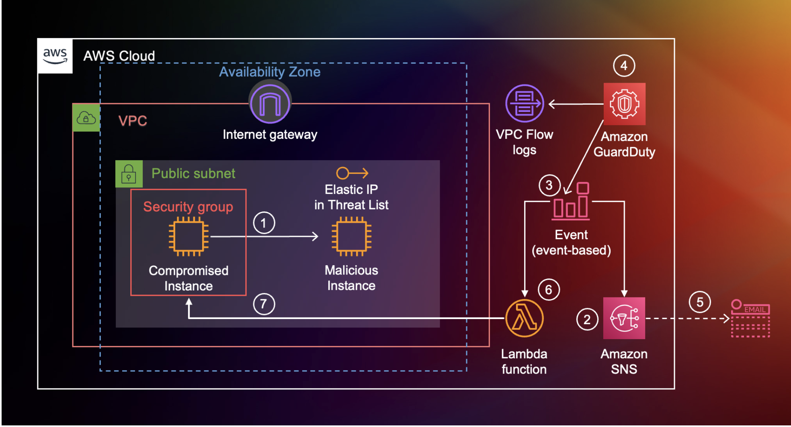
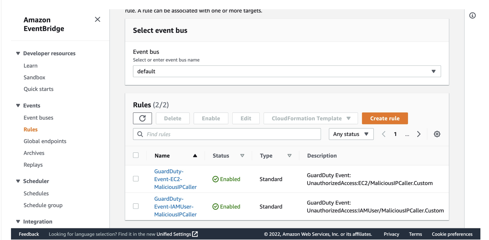
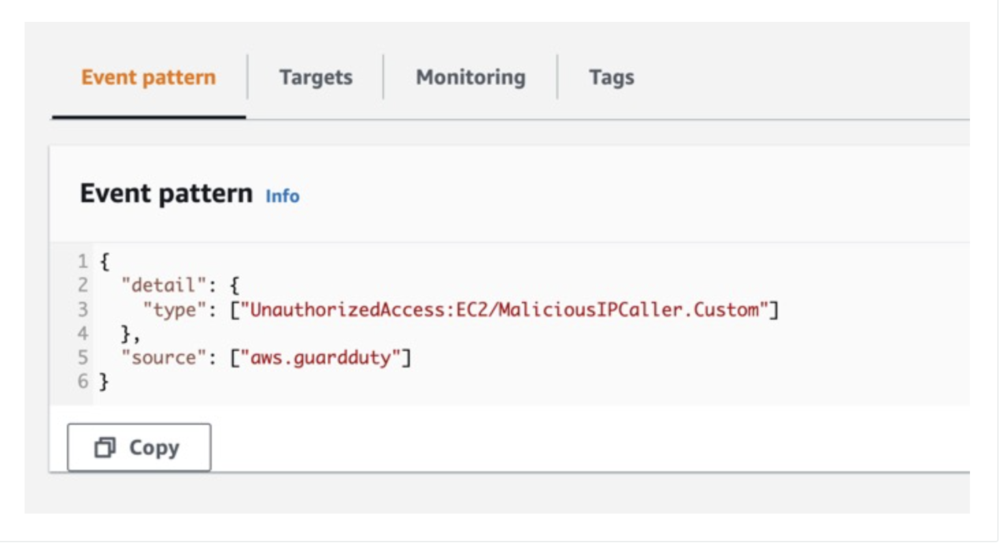
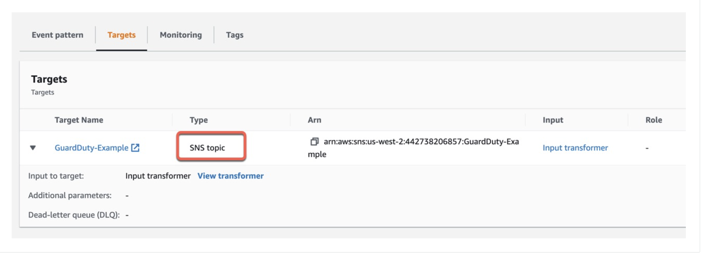
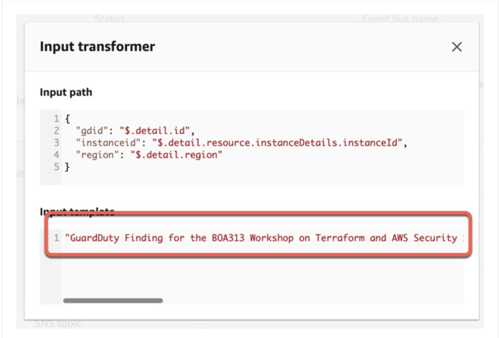
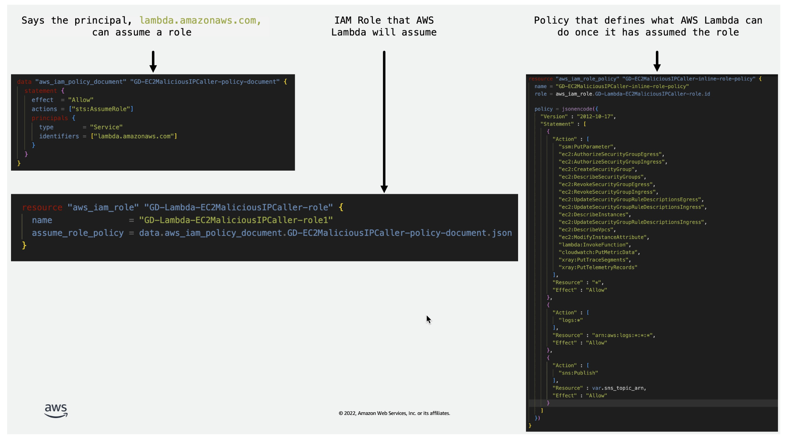
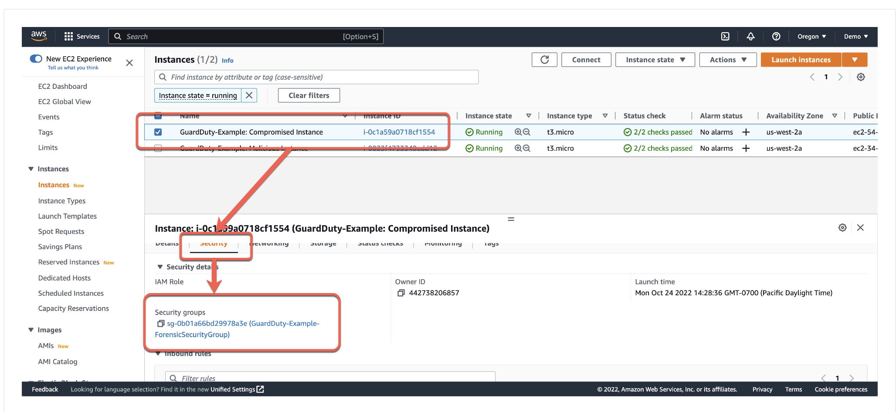
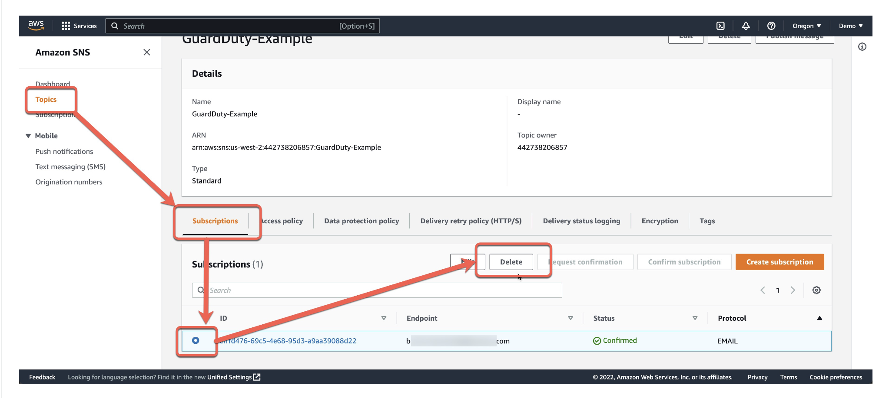

# [BOA313-R1] How to use Terraform to deploy AWS Security Solutions

## Session Description
Many modern organizations are taking an infrastructure-as-code (IaC) approach to provide a consistent language in multi-vendor environments, and Terraform is a popular choice to facilitate this. In this workshop, learn how you can use IaC for security deployments. Discover how to deploy AWS WAF, Amazon GuardDuty, AWS CloudTrail event logs, VPC Flow Logs, and DNS logs to protect your applications and provide deep monitoring capabilities. Also, find out how to activate email notifications with Amazon SNS and use Amazon EventBridge and AWS Lambda functions to automatically isolate infected hosts.

In this workshop, learn how you can use IaC for security deployments. Discover how to deploy AWS WAF, Amazon GuardDuty, AWS CloudTrail event logs, VPC Flow Logs, and DNS logs to protect your applications and provide deep monitoring capabilities. Also, find out how to activate email notifications with Amazon SNS and use Amazon EventBridge and AWS Lambda functions to automatically isolate infected hosts.

There are two focuses for this workshop:

Multiple AWS Services can leverage one another to create a larger security solution.

While the same configuraiton can be accomplished using the AWS Console, CDK, or through a CloudFormation template, this workshop will focus soley on using Terraform to deploy the solution.

This security solution encompases multiple AWS services to perform automatic isolation of an EC2 instance after GuardDuty presents findings that the host has been compromised. Throughout this workshop you will create Terraform modules to facilitate the creation of the environment. Some of the more fundamental Terraform configuration is provided for you, such as setting up the Network Infrastructure and the two EC2 instances that are used to simulate an attack and generate GuardDuty findings. You will be tasked with adding additional components to accomplish the overall goal. This includes the setup GuardDuty, EventBridge, SNS, and Lambda to perform the isolation and notification functions. The following image shows the final architecture.


### High Level Automation Goal
The process you will accomplish through this configuration is:

A "malicious" host interacts with a "compromised" host causing GuardDuty to report a finding.
The finding is matched in an EventBridge rule that does two things:
Triggers an SNS rule that sends an email to a defined admin with easy to read text explaining the finding.
Triggers a Lambda function that moves the compromised host to a forensic security group where it is isolated for furter investigation.
This workshop will take approximatley 2 hours to complete.




##### Attended 2022-11-08 at the MGM Grand Hotel Las Vegas

## Amazon Services

### Amazon GuardDuty

Amazon GuardDuty is a security monitoring service that analyzes and processes data sources. It detects abnormal behaviour for a variety of services, and reports findings. For example, for [EC2](https://docs.aws.amazon.com/guardduty/latest/ug/guardduty_finding-types-ec2.html), GuardDuty has several possible finding types.


#### EC2 Finding Types


##### Backdoor:EC2/C&CActivity.B

An EC2 instance is querying an IP that is associated with a known command and control server. The listed instance might be compromised. Command and control servers are computers that issue commands to members of a botnet.


##### Backdoor:EC2/DenialOfService.Tcp

An EC2 instance is behaving in a manner indicating it is being used to perform a Denial of Service (DoS) attack using the TCP protocol.


### AWS WAF

[AWS Web Application Firewall](https://aws.amazon.com/waf/) helps you protect against common web exploits and bots that can affect availability, compromise security, or consume excessive resources.


### AWS VPC

[Amazon Virtual Private Cloud](https://docs.aws.amazon.com/vpc/latest/userguide/what-is-amazon-vpc.html) (Amazon VPC) enables you to launch AWS resources into a virtual network that you've defined. This virtual network closely resembles a traditional network that you'd operate in your own data center, with the benefits of using the scalable infrastructure of AWS.

It allows you to configure features such as subnets, IP addressing, routing, gateways and endpoints, peering connections, traffic monitoring, and more.


### AWS CloudWatch

[Amazon CloudWatch](https://aws.amazon.com/cloudwatch/) collects and visualizes real-time logs, metrics, and event data in automated dashboards to streamline your infrastructure and application maintenance. Observe and monitor resources and applications on AWS, on premises, and on other clouds.


### AWS Lambda

[AWS Lambda](https://aws.amazon.com/lambda/) is a serverless, event-driven compute service that lets you run code for virtually any type of application or backend service without provisioning or managing servers. You can trigger Lambda from over 200 AWS services and software as a service (SaaS) applications, and only pay for what you use.


### Amazon SNS

[Amazon Simple Notification Service (SNS)](https://aws.amazon.com/sns/) sends notifications two ways, A2A and A2P. A2A provides high-throughput, push-based, many-to-many messaging between distributed systems, microservices, and event-driven serverless applications. A2P functionality lets you send messages to your customers with SMS texts, push notifications, and email. 


### Amazon EventBridge

[Amazon EventBridge](https://aws.amazon.com/eventbridge/) is a serverless event bus that helps you receive, filter, transform, route, and deliver events.


## Setup

### Install Terraform

[Docs](https://developer.hashicorp.com/terraform/tutorials/aws-get-started/install-cli)

```
brew tap hashicorp/tap
brew install hashicorp/tap/terraform

brew update
brew upgrade hashicorp/tap/terraform

# Confirm the install
terraform -v
```

### Clone the repository

[Repo](https://github.com/gabyQ/aws-labs/tree/main/tf-security)

### Setup AWS CLI

```
curl "https://awscli.amazonaws.com/AWSCLIV2.pkg" -o "AWSCLIV2.pkg"
sudo installer -pkg AWSCLIV2.pkg -target /

aws configure
# Follow steps to configure with your AWS account details
```

### Deploy the initial environment

You will initialize Terraform and apply the starting configuration. This includes the VPC with initial security group, two compute instances, and IAM user that the malicious instance will use to similate a compromise.

CD into the `blank-lab/boa313-workshop-code-initial` directory and perform a terraform init, followed by terraform plan. If the plan is successful you should perform a terraform apply -auto-approve as seen in the code below.

```
cd tf-security
cp -r blank-lab/boa313-workshop-code-initial my-terraform-lab

terraform init
terraform plan
```

### Creating and Deploying the S3 Bucket module in Terraform

Begin by creating a variable in the modules/s3/variables.tf for the vpc_id.

```
variable "vpc_id" {}
```

Next, in the `modules/s3/main.tf` file, get the current AWS user account number, create an S3 bucket resource.

```
# GET CURRENT AWS ACCOUNT NUMBER
 
 data "aws_caller_identity" "current" {}

  # CREATE AN S3 BUCKET
 
 resource "aws_s3_bucket" "bucket" {
   bucket = "guardduty-example-${data.aws_caller_identity.current.account_id}-us-east-1"
   force_destroy = true
 }
```

Next enable VPC Flow logs to the S3 bucket. This is not required, however it will allow us to view the logs that GuardDuty sees.

```
# VPC FLOW LOGS
 resource "aws_flow_log" "flow_log_example" {
   log_destination      = aws_s3_bucket.bucket.arn
   log_destination_type = "s3"
   traffic_type         = "ALL"
   vpc_id               = var.vpc_id
 }
```

Lastly, output the `bucket_id` and `bucket_arn` values in the `modules/s3/outputs.tf` file.

```
# S3 Bucket id
 output "bucket_id" {
   value       = aws_s3_bucket.bucket.id
   description = "Output of s3 bucket id."
 }
 # S3 Bucket arn
 output "bucket_arn" {
   value       = aws_s3_bucket.bucket.arn
   description = "Output of s3 bucket arn."
 }
```

Now return to the root/main.tf file and add the S3 bucket.

```
# # CREATES S3 BUCKET
module "s3_bucket" {
  source = "./modules/s3"
  vpc_id = module.vpc.vpc_id
}
```

At the command prompt, initialize terraform to read the new S3 module.

Run `terraform init` followed by `terraform plan`.

And finally, perform a `terraform apply -auto-approve`.

You can verify that the S3 bucket has been created in the AWS console.

Now that the S3 bucket is created you can move on to the next step.

> Why are you creating an S3 bucket? You are primarily creating an S3 bucket to hold a text file that will be
> refered to by GuardDuty. GuardDuty uses two types of lists. 1.) a Trusted IP list, and 2.) a Threat IP
> list. Our S3 bucket will host the Threat IP List. The secondary reason is to store VPC flow logs. GuardDuty
> uses VPC flow logs, but you do not need to enable them for GuardDuty to use them. Here, we enable VPC FLow
> Logs so that we can use the data in other tools if we want to later on.


### Deploying GuardDuty with Terraform

In this section we will use Terraform to enable GuardDuty in a single region.

The GuardDuty Module files have been created for you but like the S3 files, they are empty. Start with the `modules/guardduty/variables.tf` file. Here you will need to create two variables. The first is a variable called bucket which we will use to define the S3 bucket threat list details. The second will be for the malicious IP that we will have added to the bucket.

```
variable "bucket" {

}

variable "malicious_ip" {

}
```

Next move to the `modules/guardduty/main.tf` file.

In this file you will add three resources. The first resource is the [GuardDuty Detector](https://registry.terraform.io/providers/hashicorp/aws/latest/docs/resources/guardduty_detector). You'll note in the provider documentation that the options are all optional, nothing is required other than declaring the resource. However, we will set the enabled value to true in our example and also change the `finding_publishing_frequency` to 15 minutes. The default is one hour.

```
# ENABLE THE DETECTOR
resource "aws_guardduty_detector" "reinvent-gd" {
  enable = true
  finding_publishing_frequency = "FIFTEEN_MINUTES"

}
```

Next we will [upload a file to the s3 bucket](https://registry.terraform.io/providers/hashicorp/aws/latest/docs/resources/s3_object) that we created in a previous step. 

This is not required, but for demonstration purposes we want to use the IP address of one of the EC2 instances to ensure that findings are generated in this workshop. So in the code below we are uploading a text file to our S3 bucket, calling it `MyThreatIntelSet`, and the content of the file will be the IP address found in the variable `var.malicious_ip`.

```
# ADD THE EIP/MALICIOUS IP TO THE BUCKET AS A TEXT FILE.
resource "aws_s3_object" "MyThreatIntelSet" {
  content = var.malicious_ip
  bucket  = var.bucket
  key     = "MyThreatIntelSet"
}
```

Finally we will create a resource, `aws_guardduty_threatintelset` that tells GuardDuty that it should use (this is what the activate = true does) the file located at the location defined.

```
# HAVE GUARDDUTY LOOK AT THE TEXT FILE IN S3
resource "aws_guardduty_threatintelset" "Example-Threat-List" {
  activate    = true
  detector_id = aws_guardduty_detector.reinvent-gd.id
  format      = "TXT"
  location    = "https://s3.amazonaws.com/${aws_s3_object.MyThreatIntelSet.bucket}/${aws_s3_object.MyThreatIntelSet.key}"
  name        = "MyThreatIntelSet"
}
```

For GuardDuty we don't need to output anything at this point in time.

Next move to the `root/main.tf` file and call the GuardDuty module. We need to provide the bucket ID and the malicious IP. You can see that these are coming from the s3 module and the compute module.

```
module "guardduty" {
  source       = "./modules/guardduty"
  bucket       = module.s3_bucket.bucket_id
  malicious_ip = module.compute.malicious_ip
}
```

Next, perform the `terraform init` command to initialize the module.

Next, perform the `terraform plan`.

If the plan is successful, perform the `terraform apply`.


You can verify that GuardDuty is enabled by navigating to the GuardDuty service in the AWS Console. In the output below you can see the threat list has been created and is referenced by GuardDuty.

Now that GuardDuty is enabled we will want to expand the functionality of our solution. In the next step we will add email notifications to the solution.

### Creating the SNS Policy

In this section we will use Terraform  to create an SNS Rule. SNS is the Simple Notification Service and it enabled you to send notification when certain critiera is met. SNS itself doesn't match an action to send a message, rather we will use EventBridge for that. However since EventBridge will need a rule to send notifications we create the SNS rule first.

Beginning in the `modules/sns/variables.tf` file you will need to create two variables.

1. sns_name to name the SNS topic that we will create.
2. email to hold the email address we will use to subscribe to our notifications.


Below is an example of our variables for SNS.

```
variable "sns_name" {
  description = "Name of the SNS Topic to be created"
  default     = "GuardDuty-Example"
}

variable "email" {
 description = "Email address for SNS"
}
```

Next we will create the SNS topic and subscription in the `modules/sns/main.tf` file.

Start by creating a topic resource.

```
# Create the SNS topic
 
 resource "aws_sns_topic" "gd_sns_topic" {
   name = var.sns_name
 }
```

In the above code you are creating a resource which is called "gd_sns_topic" by Terraform. In the AWS console this will be called "GuardDuty-Example". This is because we are calling the variable `var.sns_name` and it has a default set to "GuardDuty-Example".

Next create an SNS Policy Resource. The arn and policy are required values. The policy being created here is an AWS IAM Policy Document . This policy document is allowing the service principal events.amazonaws.com to publish to the topic.

```
resource "aws_sns_topic_policy" "gd_sns_topic_policy" {
   arn = aws_sns_topic.gd_sns_topic.arn
   policy                                   = jsonencode(
         {
             Id        = "ID-GD-Topic-Policy"
             Statement = [
                 {
                     Action    = "sns:Publish"
                     Effect    = "Allow"
                     Principal = {
                         Service = "events.amazonaws.com"
                     }
                     Resource  = aws_sns_topic.gd_sns_topic.arn
                     Sid       = "SID-GD-Example"
                 },
             ]
             Version   = "2012-10-17"
         }
     )
 }
```

Next you will create the topic subscription. The topic subscription calls the ARN, sets the protocol to be used, in this case email, and the email address to send the notificaiton to. The email address in this case will be hard coded but you can configure it to prompt for the email address when you apply the terraform. Also, the `endpoint_auto_confirm` being set to false means that the owner of the email will get an email with a link that they must click on to subscribe to the notifications.

```
# Create the topic subscription 
 
 resource "aws_sns_topic_subscription" "user_updates_sqs_target" {
   topic_arn              = aws_sns_topic.gd_sns_topic.arn
   protocol               = "email"
   endpoint               = var.email
   endpoint_auto_confirms = false
 }
```

Next, in the `modules/sns/outputs.tf` file we want to output the ARN of the topic so we can reference that in the EventBridge configuration we will perform later.

```
output "sns_topic_arn" {
  value       = aws_sns_topic.gd_sns_topic.arn
  description = "Output of ARN to call in the eventbridge rule."
}
```

Finally, return to the `root/main.tf` file and add the SNS topic. This is where you will set the email address to be subscribed. Be sure to update the email to be hard-coded to your email address.

```
# Creates an SNS Topic

 module "guardduty_sns_topic" {
   source = "./modules/sns"
   email  = "<YOUR EMAIL HERE>"
 }
```

Now it's time to applyn the Terraform. To do so follow these steps:

1. Perform a `terraform init` to initialize the new sns module.
2. Perform a `terraform plan` to ensure that plan is successful.
3. Perform a `terraform apply` to apply the code to your AWS environment.

Once the SNS topic is created and the subscription is confirmed we can move on to the EventBridge Rule.

### Creating the EventBridge Rule

In this section you will use Terraform  to create an Eventbridge Rule. The EventBridge Rule will tie two elements of this solution together.

How does EventBridge work? EventBridge receives an event, an indicator of a change in environment, and applies a rule to route the event to a target. Rules match events to targets based on either the structure of the event, called an event pattern, or on a schedule. In this case, GuardDuty creates an event for Amazon EventBridge when any change in findings takes place. The event matches and Amazon EventBridge rule to a target, in this case its an SNS rule. The SNS rule takes the finding data and generates an email notification to the subscribed user. This can be seen in the image below.

So the EventBridge rule will need information about GuardDuty as well as SNS. Begin by creating a variable that can be used for the SNS topic ARN. Do this in the `modules/eventbridge/variables.tf` file.

```
variable "sns_topic_arn" {
 }
```

Next create an Event Rule Resource in the `modules/eventbridge/main.tf` file. You will need to define the source as well as the type of event we are looking for.

```
# EVENT RULE RESOURCE
 resource "aws_cloudwatch_event_rule" "GuardDuty-Event-EC2-MaliciousIPCaller" {
   name        = "GuardDuty-Event-EC2-MaliciousIPCaller"
   description = "GuardDuty Event: UnauthorizedAccess:EC2/MaliciousIPCaller.Custom"

   event_pattern = <<EOF
 {
   "source": ["aws.guardduty"],
   "detail": {
     "type": ["UnauthorizedAccess:EC2/MaliciousIPCaller.Custom"]
   }
 }
 EOF
 }
```

Next define the Event Target Resource. When creating this resource you can add an extra bit of readability into the email notification by defining an [Input Transformer](https://docs.aws.amazon.com/eventbridge/latest/userguide/eb-input-transformer-tutorial.html). 

This customizes what EventBridge passes to the event target. Below we are getting the GuardDuty ID, the Region, and the EC2 Instance ID and we are creating an input tempalte that elaborates a bit on the message. You can see below that we have created an input template that makes use of the detail information in the GuardDuty finding in the email message that is sent.

```
# EVENT TARGET RESOURCE FOR SNS NOTIFICATIONS
 resource "aws_cloudwatch_event_target" "sns" {

   rule      = aws_cloudwatch_event_rule.GuardDuty-Event-EC2-MaliciousIPCaller.name
   target_id = "GuardDuty-Example"
   arn       = var.sns_topic_arn

   input_transformer {
     input_paths = {
       gdid     = "$.detail.id",
       region   = "$.detail.region",
       instanceid = "$.detail.resource.instanceDetails.instanceId"
     }
     input_template = "\"GuardDuty Finding for the BOA313 Workshop on Terraform and AWS Security Solutions. | ID:<gdid> | The EC2 instance: <instanceid>, may be compromised and should be investigated. Go to https://console.aws.amazon.com/guardduty/home?region=<region>#/findings?macros=current&fId=<gdid>\""
   }
 }
```

In the first Event rule that we created we are looking for the **GuardDuty-Event-EC2-MaliciousIPCaller** event. Create a second event rule to look for the **GuardDuty-Event-IAMUser-MaliciousIPCaller** finding and send an email notification for that as well.

```
# EVENT RULE RESOURCE
 resource "aws_cloudwatch_event_rule" "GuardDuty-Event-IAMUser-MaliciousIPCaller" {
   name        = "GuardDuty-Event-IAMUser-MaliciousIPCaller"
   description = "GuardDuty Event: UnauthorizedAccess:IAMUser/MaliciousIPCaller.Custom"
   event_pattern = <<EOF
 {
   "source": ["aws.guardduty"],
   "detail": {
     "type": ["UnauthorizedAccess:IAMUser/MaliciousIPCaller.Custom", "Discovery:S3/MaliciousIPCaller.Custom"]
   }
 }
 EOF
 }

 #EVENT TARGET RESOURCE FOR SNS NOTIFICATIONS
 resource "aws_cloudwatch_event_target" "iam-sns" {

   rule      = aws_cloudwatch_event_rule.GuardDuty-Event-IAMUser-MaliciousIPCaller.name
   target_id = "GuardDuty-Example"
   arn       = var.sns_topic_arn

   input_transformer {
     input_paths = {
       gdid     = "$.detail.id",
       region   = "$.detail.region",
       userName = "$.detail.resource.accessKeyDetails.userName"
     } 
     input_template = "\"GuardDuty Finding also for re:Inforce 2022 | ID:<gdid> | AWS Region:<region>. An AWS API operation was invoked (userName: <userName>) from an IP address that is included on your threat list and should be investigated.Go to https://console.aws.amazon.com/guardduty/home?region=<region>#/findings?macros=current&fId=<gdid>\""
   }
 }
 ```

Once you have the resources created in the module, go back to the `root/main.tf` file and add the EventBridge rule.

```
# Create the EventBridge rule

module "guardduty_eventbridge_rule" {
  source                          = "./modules/eventbridge"
  sns_topic_arn                   = module.guardduty_sns_topic.sns_topic_arn
}
```

To finish the task, initialize, plan, and apply the Terraform code.

Once applied you should see at least two new resources (if you opted not to do the extra rule), or four new resources having been added.

Now you can verify in the AWS Console. First navigate to the EventBridge rules. Here you can see two rules.



Navigating into the rule shows the pattern you are matching.



Selecting the targets tab you can see this is targeting an SNS topic.



And looking at the Input Transform you can see the text that we are creating from the finding data.



At this point you will begin recieving email notifications as the findings are updated. **This may take some time to begin generating the SNS notifications.**

### Creating Lambda Remediation with Terraform

In this section we will use Terraform  to create a Lambda function that perform a remediation function for our environment. What we want to do with this workshop is have our compromised host get moved to a new security group. Similar to the way that EventBridge used SNS to generate an email, EventBridge will invole a Lambda function as see below.

One thing to keep in mind is that there are many possibilities here. For more information please see the [Creating custom responses to GuardDuty findings with Amazon CloudWatch Events](https://docs.aws.amazon.com/guardduty/latest/ug/guardduty_findings_cloudwatch.html) documentation as well as [Automatically block suspicious traffic with AWS Network Firewall and Amazon GuardDuty](https://aws.amazon.com/blogs/security/automatically-block-suspicious-traffic-with-aws-network-firewall-and-amazon-guardduty/) for more information.

To get us started lets see what needs to happen for this to work.

Currently, our GuardDuty Findings are matched in an EventBridge rule to a target, currently an SNS rule that sends an email. To enhance this functionality we will have EventBridge use AWS Lambda as a target.

Because we are going to have AWS Lambda access other resources on our behalf, we need to create an IAM role to delegate permissions to the service . This is called a service role and AWS Lambda will assume this role when it changes the security group of our EC2 instance.

The following image shows how the first three code blocks fit together to allow the AWS Lambda service to assume a role that can make changes to the security groups assigned to the EC2 instances.



#### [Build the IAM policy elements for AWS Lambda](https://catalog.us-east-1.prod.workshops.aws/event/dashboard/en-US/workshop/09-create-a-lambda-module#build-the-iam-policy-elements-for-aws-lambda)

Start in the `modules/lambda/main.tf` by creating the IAM policy document. This is the trust relationship for the policy.

```
data "aws_iam_policy_document" "GD-EC2MaliciousIPCaller-policy-document" {
  statement {
    effect  = "Allow"
    actions = ["sts:AssumeRole"]
    principals {
      type        = "Service"
      identifiers = ["lambda.amazonaws.com"]
    }
  }
}
```

Next, create the inline policy that will be applied to the role AWS Lambda will assume.

```
resource "aws_iam_role_policy" "GD-EC2MaliciousIPCaller-inline-role-policy" {
  name = "GD-EC2MaliciousIPCaller-inline-role-policy"
  role = aws_iam_role.GD-Lambda-EC2MaliciousIPCaller-role.id

  policy = jsonencode({
    "Version" : "2012-10-17",
    "Statement" : [
      {
        "Action" : [
          "ssm:PutParameter",
          "ec2:AuthorizeSecurityGroupEgress",
          "ec2:AuthorizeSecurityGroupIngress",
          "ec2:CreateSecurityGroup",
          "ec2:DescribeSecurityGroups",
          "ec2:RevokeSecurityGroupEgress",
          "ec2:RevokeSecurityGroupIngress",
          "ec2:UpdateSecurityGroupRuleDescriptionsEgress",
          "ec2:UpdateSecurityGroupRuleDescriptionsIngress",
          "ec2:DescribeInstances",
          "ec2:UpdateSecurityGroupRuleDescriptionsIngress",
          "ec2:DescribeVpcs",
          "ec2:ModifyInstanceAttribute",
          "lambda:InvokeFunction",
          "cloudwatch:PutMetricData",
          "xray:PutTraceSegments",
          "xray:PutTelemetryRecords"
        ],
        "Resource" : "*",
        "Effect" : "Allow"
      },
      {
        "Action" : [
          "logs:*"
        ],
        "Resource" : "arn:aws:logs:*:*:*",
        "Effect" : "Allow"
      },
      {
        "Action" : [
          "sns:Publish"
        ],
        "Resource" : var.sns_topic_arn,
        "Effect" : "Allow"
      }      
    ]
  })
}
```

And now create the IAM role that AWS Lambda will assume.

```
resource "aws_iam_role" "GD-Lambda-EC2MaliciousIPCaller-role" {
  name               = "GD-Lambda-EC2MaliciousIPCaller-role1"
  assume_role_policy = data.aws_iam_policy_document.GD-EC2MaliciousIPCaller-policy-document.json
}
```

With the role created we now move on to the configuration of the Lambda function.

#### [Configure the Lambda function](https://catalog.us-east-1.prod.workshops.aws/event/dashboard/en-US/workshop/09-create-a-lambda-module#configure-the-lambda-function)

The Python code we will use for the Lambda function has been created for you. We will walk through the code in a later section. The code can be found in the `/boa313-workshop-code-initial/modules/lambda/code folder` and it's called index.py. Add this to ``

```
data "archive_file" "python_lambda_package" {
  type        = "zip"
  source_file = "${path.module}/code/index.py"
  output_path = "index.zip"
}
```

Next we need to give EventBridge permission to access Lambda.

```
resource "aws_lambda_permission" "GuardDuty-Hands-On-RemediationLambda" {
  statement_id  = "GuardDutyTerraformRemediationLambdaEC2InvokePermissions"
  action        = "lambda:InvokeFunction"
  function_name = aws_lambda_function.GuardDuty-Example-Remediation-EC2MaliciousIPCaller.function_name
  principal     = "events.amazonaws.com"
}
```

The above block will give EventBridge permission to invoke the Lambda function.

Finally we create the Lambda function resource. To do this we will need to create a few variables that will let us pass some info. Edit the `modules/lambda/variables.tf` file with the following variables:

```
variable "sns_topic_arn" {}

variable "compromised_instance_id" {}

variable "forensic_sg_id" {}
```

Next, return to the `modules/lambda/main.tf` file and create the Lambda function resource. Note that in the code block below that we are using Python 3.9. Also, we are referecing the python code we zipped in index.zip. And lastly we are setting a few environment variables in the resource, INSTANCE_ID, FORENSICS_SH, and TOPIC_ARN. These will be passed into our Lambda function environment from the variables that we created.

```
# Create the Lambda function Resource

resource "aws_lambda_function" "GuardDuty-Example-Remediation-EC2MaliciousIPCaller" {
  function_name    = "GuardDuty-Example-Remediation-EC2MaliciousIPCaller"
  filename         = "index.zip"
  source_code_hash = data.archive_file.python_lambda_package.output_base64sha256
  role             = aws_iam_role.GD-Lambda-EC2MaliciousIPCaller-role.arn
  runtime          = "python3.9"
  handler          = "index.handler"
  timeout          = 10
  environment {
    variables = {
      INSTANCE_ID  = var.compromised_instance_id
      FORENSICS_SG = var.forensic_sg_id
      TOPIC_ARN    = var.sns_topic_arn
    }
  }
}
```

Before moving on to the root/main.tf file, lets have a look a the Python code that's already been created for you. We will assume some coding knowledge here and provide a basic explaination of some of the following sections of code.

The code will change the security group of the EC2 instance that needs to be quarantined

Now that we've looked at the code, lets implement the Lambda function in Terraform.

In the root/main.tf file call the Lambda module, set the SNS topic ARN, the Compromised Instance ID, and the Forensic Security group. Note that these values are coming from the GuardDuty Module, the Compute Module, and the VPC Module.

```
module "lambda" {
  source                  = "./modules/lambda"
  sns_topic_arn           = module.guardduty_sns_topic.sns_topic_arn
  compromised_instance_id = module.compute.compromised_instance_id
  forensic_sg_id          = module.vpc.forensic_sg_id
}
```

The Forensic Security group has not been created yet. Return to the `modules/vpc/main.tf` and add a security group to use for forensics.

```
# FORENSIC SECURITY GROUP
 resource "aws_security_group" "forensic_sg" {
   vpc_id = aws_vpc.vpc.id
   name   = "${var.vpc_name}-ForensicSecurityGroup"

   ingress {
     protocol    = "icmp"
     self        = true
     from_port   = -1
     to_port     = -1
     cidr_blocks = ["10.0.0.0/24"]
   }

   egress {
     from_port   = 0
     to_port     = 0
     protocol    = "-1"
     cidr_blocks = ["0.0.0.0/0"]
   }

   tags = {
     Name = "${var.vpc_name}-ForensicSecurityGroup"
   }
 }
```

To access the forensic_sh_id we need to output that from the VPC module. Return to the modules/vpc/outputs.tf file and output the Security group ID.

```
output "forensic_sg_id" {
   value       = aws_security_group.forensic_sg.id
   description = "Output of forensic sg id created - to place the EC2 instance(s)."
 }

```

To apply, do the init, plan, and apply Terraform commands.

#### Modify EventBridge to Trigger Lambda

In this step you will modify the EventBridge configuration to add the Lambda function as a target. You already have an event rule that matches the GuardDuty Finding. This modification will simply add the Lambda Function as a target for the rule so the remediation function is triggered along with the email notification.

Return to the `modules/eventbridge/main.tf` file.

Add an event target resource for the Lambda Function that looks at the aws_cloudwatch_event_rule.GuardDuty-Event-EC2-MaliciousIPCaller.name rule and sets the target ID to GuardDuty-Example-Remediation. You will need the ARN of the Lambda Function here. This can be output from the Lambda Module.

```
#EVENT TARGET RESOURCE FOR LAMBDA REMEDIATION FUCTION

resource "aws_cloudwatch_event_target" "lambda_function" {

  rule      = aws_cloudwatch_event_rule.GuardDuty-Event-EC2-MaliciousIPCaller.name
  target_id = "GuardDuty-Example-Remediation"
  arn       = var.lambda_remediation_function_arn
}
```

Add the output to the Lambda Module (modules/lambda/outputs.tf) if you haven't done so already.

```
output "lambda_remediation_function_arn" {
  value = aws_lambda_function.GuardDuty-Example-Remediation-EC2MaliciousIPCaller.arn
}
```

The variable also needs to be applied in the EventBridge module(modules/eventbridge/variables.tf).

```
variable "lambda_remediation_function_arn" {

}
```

And finally, add the lambda_remediation_function_arn to the root/main.tf file. This goes in the EventBridge Rule which is already created. The output below is the entire code block, some of which already exists. Be sure to only add the lambda_remediation_function_arn = module.lambda.lambda_remediation_function_arn code to the existing block.

```
module "guardduty_eventbridge_rule" {
  source                          = "./modules/eventbridge"
  sns_topic_arn                   = module.guardduty_sns_topic.sns_topic_arn
  lambda_remediation_function_arn = module.lambda.lambda_remediation_function_arn
}
```

Be sure to do a terraform plan and an terraform apply to push the changes to AWS.

### Verify the Full Solution

In this section we will walk through the entire solution in the AWS console and verify that the security group has been moved once the finding shows up in GuardDuty and EventBridge triggers the Lambda Function.

Start by verifying that there are two EC2 instances and they are both in the Initial Security Group. There should be a comprimised and malicious host.

Next ensure that GuardDuty is reporting findings.

Now check that the eventbridge rule is looking for that finding.

Next check the target of the EventBridge Rule. You should see one SNS target and one Lambda target.

Check the SNS rule to see what it does. It should be sending an email to the address you set.

Next Check the Lambda Function. You can get there from the EventBridge Rule or by navigating there directly.

Finally check that the Lambda Function has moved the Compromised host to a new Security Group.



Depending on the time you have waited, if your configuration matches the screenshots above you have successfully created an entire AWS Security solution using Terraform. Congratulations!

In the next section we will perform a clean-up of our environment and share additional resources.


### Clean Up

At this point in the workshop you are likley getting emails every 15 minutes as GuardDuty reports its Findings. If you prefer to keep the configurations to reference later but stop the emails you can simply unsubscribe from the topic. See the example below on how to delete the subscription.



Run `terraform destroy`


## Notes

- Guard Duty cost model only bills based on what it ingests, best practice to enable on envs that you may not use
- Lambda will change the security group of the EC2 instance that needs to be quarantined


## Resources

[Use AWS Network Firewall to filter outbound HTTPS traffic from applications hosted on Amazon EKS and collect hostnames provided by SNI](https://aws.amazon.com/blogs/security/use-aws-network-firewall-to-filter-outbound-https-traffic-from-applications-hosted-on-amazon-eks/)

[How to use CI/CD to deploy and configure AWS security services with Terraform](https://aws.amazon.com/blogs/security/how-use-ci-cd-deploy-configure-aws-security-services-terraform/)

[Terraform AWS modules](https://github.com/terraform-aws-modules)

[Provision AWS infrastructure using Terraform (By HashiCorp): an example of web application logging customer data](https://aws.amazon.com/blogs/developer/provision-aws-infrastructure-using-terraform-by-hashicorp-an-example-of-web-application-logging-customer-data/)

[Use Terraform to automatically enable Amazon GuardDuty for an organization](https://docs.aws.amazon.com/prescriptive-guidance/latest/patterns/use-terraform-to-automatically-enable-amazon-guardduty-for-an-organization.html)

[How to set up AWS WAF v2 with Terraform](https://dev.to/aws-builders/how-to-setup-aws-waf-v2-21f1)
